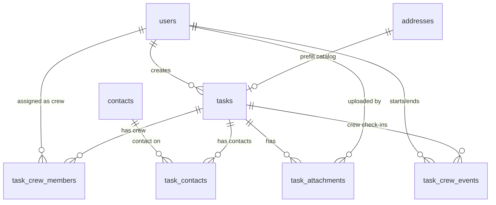

# Database Design (Relational)

Normalized relational schema for Field, derived from the flat task export in [`task-model.md`](task-model.md).

**Master design document:** [`sdd.md`](sdd.md)

**Decisions:**

- **Relational database** — PostgreSQL (local Docker in dev; RDS on AWS in production).
- **Primary keys** — `bigint` identity for internal entities; `uuid` for users (Entra `oid` mapped to UUID for web-authenticated users).
- **Timestamps** — `timestamptz` stored in UTC.
- **Coordinates** — `numeric` latitude/longitude on `addresses` (destination). Crew start/end geotags live on `task_crew_events` (nullable lat/lng + accuracy).
- **No teams** — company-local workforce; tasks are assigned to individual **crew members** only. Reference `AssignedToTeamId` is ignored. Field does not use the word "driver".
- **Task type / status** — PostgreSQL enums (`task_type`, `task_status`) stored as text labels on `tasks` (e.g. `Delivery`, `Loaded`). No FK from `tasks` to lookup tables.
- **No dispatch address** — destination only; `dispatch_address_id` is not modeled.
- **Contacts vs addresses** — `contacts` are people (name/title/phone/email). `addresses` are destinations with optional `address_name` (venue label). They are independent.
- **Task assignment** — 0..many contacts via `task_contacts` (same pattern as `task_crew_members`). Destination fields live on the task; `addresses` is catalog/prefill only (optional `destination_address_id`).

---

## Entity Relationship Overview



---

## Table Groups

| Group             | Tables                                                                       | Purpose                                                                  |
| ----------------- | ---------------------------------------------------------------------------- | ------------------------------------------------------------------------ |
| Identity & access | `users`, `mobile_activation_codes`, `mobile_devices`                         | Web auth (Entra ID); mobile QR activation + device sessions              |
| Locations         | `addresses`                                                                  | Venue catalog (`address_name`); tasks store their own destination fields |
| Contacts          | `contacts`                                                                   | People (name, title, phone, email) — not venues                          |
| Core              | `tasks`, `task_crew_members`, `task_contacts`                                | Primary unit of work; crew + contacts + optional destination             |
| Task extensions   | `task_attachments`, `task_crew_events`, `task_documents`, `email_deliveries` | Photos, crew start/end logs, PDFs, outbound email log                    |

---

## Identity & Access

### `users`

People who create or execute tasks. Web users authenticate via Microsoft Entra ID; `users.id` is derived from Entra `oid`. Mobile crew members activate via QR (see below); user records still exist for assignment and audit. Amazon Cognito is not used.

| Column         | Type           | Constraints           | Maps from reference                             |
| -------------- | -------------- | --------------------- | ----------------------------------------------- |
| `id`           | `uuid`         | PK                    | `AssignedToDriverUserId` (reference)            |
| `display_name` | `varchar(255)` | NOT NULL              | `DriverName` (reference), `TaskCreatedBy`       |
| `email`        | `varchar(255)` | UNIQUE, nullable      | —                                               |
| `phone`        | `varchar(50)`  | nullable              | —                                               |
| `role`         | `varchar(50)`  | NOT NULL              | creator, crew, admin, supervisor (expand later) |
| `is_active`    | `boolean`      | NOT NULL DEFAULT true | —                                               |
| `created_at`   | `timestamptz`  | NOT NULL              | —                                               |
| `updated_at`   | `timestamptz`  | NOT NULL              | —                                               |

**Notes:**

- A user may hold multiple roles over time; MVP uses a single `role` column. Split to `user_roles` if needed later.
- Crew members are users with role `crew` (called "driver" in the reference system — Field uses **crew member**).
- **Web:** creators and admins authenticate; actions tied to logged-in user.
- **Mobile:** shared Capacitor build ships deactivated; crew activates by scanning a QR issued for their user. Durable device session until revoked remotely.

### Authentication model

| Client             | User login                     | Typical actions                                              |
| ------------------ | ------------------------------ | ------------------------------------------------------------ |
| Web                | Yes (Entra ID)                 | Create tasks, assign crew, admin, issue/revoke mobile access |
| Mobile (Capacitor) | QR activation → device session | View assigned tasks, update status, upload photos            |

The `users` table is required for assignment and web auth. Mobile identity comes from a **device session** created at QR activation (not build-time embedding).

### `mobile_activation_codes`

One-time (or short-lived) codes encoded in QR images issued from the web app for a specific crew user.

| Column               | Type           | Constraints               | Notes                             |
| -------------------- | -------------- | ------------------------- | --------------------------------- |
| `id`                 | `uuid`         | PK                        | —                                 |
| `user_id`            | `uuid`         | NOT NULL, FK → `users.id` | Crew member this code activates   |
| `code_hash`          | `varchar(255)` | NOT NULL, UNIQUE          | Store hash only — never plaintext |
| `expires_at`         | `timestamptz`  | NOT NULL                  | Short TTL preferred               |
| `used_at`            | `timestamptz`  | nullable                  | Set when redeemed                 |
| `created_by_user_id` | `uuid`         | NOT NULL, FK → `users.id` | Admin/creator who issued          |
| `created_at`         | `timestamptz`  | NOT NULL                  | —                                 |
| `revoked_at`         | `timestamptz`  | nullable                  | Invalidate unused codes           |

**Notes:** QR payload is plain text `field1.<base64url-32-bytes>` (SHA-256 stored in `code_hash`). Codes are **single-use** with a **24-hour** TTL. Multiple devices per user are allowed.

### `mobile_devices`

Registered devices after successful QR activation. Holds the durable session the app stores locally; admins revoke here to pull access remotely.

| Column               | Type           | Constraints                                 | Notes                               |
| -------------------- | -------------- | ------------------------------------------- | ----------------------------------- |
| `id`                 | `uuid`         | PK                                          | —                                   |
| `user_id`            | `uuid`         | NOT NULL, FK → `users.id`                   | Bound crew member                   |
| `token_hash`         | `varchar(255)` | NOT NULL, UNIQUE                            | Hash of device session token        |
| `device_label`       | `varchar(255)` | nullable                                    | Optional (model / name from client) |
| `activated_at`       | `timestamptz`  | NOT NULL                                    | —                                   |
| `last_seen_at`       | `timestamptz`  | nullable                                    | Updated on API use                  |
| `revoked_at`         | `timestamptz`  | nullable                                    | Remote pull — API returns 401       |
| `revoked_by_user_id` | `uuid`         | nullable, FK → `users.id`                   | Who revoked                         |
| `activation_code_id` | `uuid`         | nullable, FK → `mobile_activation_codes.id` | Audit trail                         |

**Notes:**

- Client stores the opaque session token permanently; server stores only `token_hash`.
- On revoke: set `revoked_at`; next mobile request fails; app clears local session and shows QR activation again.
- Whether one device per user or many is an open question — schema allows many.

---

## Locations

### `addresses`

Venue catalog for search / autocomplete. Selecting an address prefills the task destination fields; edits on a task do **not** mutate the catalog row. Optional `tasks.destination_address_id` records which catalog venue was picked. Field has **no pickup/dispatch address** — the company operates from one fixed location. Contacts (`contacts`) are not linked to addresses. Use `address_name` for the venue label users pick (e.g. Park MGM).

| Column         | Type            | Constraints | Maps from reference                           |
| -------------- | --------------- | ----------- | --------------------------------------------- |
| `id`           | `bigint`        | PK          | —                                             |
| `address_name` | `varchar(255)`  | nullable    | Venue / location display name (e.g. Park MGM) |
| `street_line`  | `varchar(500)`  | NOT NULL    | `DestinationAddress`                          |
| `building`     | `varchar(255)`  | nullable    | `DestinationBuilding`                         |
| `notes`        | `text`          | nullable    | `DestinationNotes`                            |
| `latitude`     | `numeric(10,7)` | nullable    | parsed from `DestinationCoordinates`          |
| `longitude`    | `numeric(10,7)` | nullable    | parsed from `DestinationCoordinates`          |
| `deleted_at`   | `timestamptz`   | nullable    | Soft delete — null = active                   |
| `created_at`   | `timestamptz`   | NOT NULL    | —                                             |

**Index:** `(address_name)`; `(latitude, longitude)` if geospatial queries are needed later (PostGIS optional).

**Soft delete:** `DELETE` API sets `deleted_at = now()`. Lists and detail GET require `deleted_at IS NULL`.

---

## Contacts

### `contacts`

Contacts (people to notify or reference on a task). Assigned to tasks through `task_contacts`, not stored as denormalized columns on `tasks`. Venue / place names belong on the task destination fields (and the `addresses` catalog), not here.

| Column       | Type           | Constraints | Maps from reference                                        |
| ------------ | -------------- | ----------- | ---------------------------------------------------------- |
| `id`         | `bigint`       | PK          | `RecipientId`                                              |
| `name`       | `varchar(255)` | NOT NULL    | `RecipientName`                                            |
| `title`      | `varchar(255)` | nullable    | Role / relationship (e.g. Electrical manager) — Field-only |
| `phone`      | `varchar(50)`  | nullable    | `RecipientPhone`                                           |
| `email`      | `varchar(255)` | nullable    | `RecipientEmail` (single address)                          |
| `deleted_at` | `timestamptz`  | nullable    | Soft delete — null = active                                |
| `created_at` | `timestamptz`  | NOT NULL    | —                                                          |
| `updated_at` | `timestamptz`  | NOT NULL    | —                                                          |

**Soft delete:** `DELETE` API sets `deleted_at = now()`. Lists and detail GET require `deleted_at IS NULL`.

---

## Task enums (on `tasks`)

PostgreSQL enum types store the text labels used by the reference export and the app.

### `task_type` (enum)

| Value         |
| ------------- |
| `Delivery`    |
| `Install`     |
| `Removal`     |
| `Site Survey` |
| `Pickup`      |
| `Other`       |

### `task_status` (enum)

| Value          | Notes                               |
| -------------- | ----------------------------------- |
| `Unassigned`   | Initial / no crew member yet        |
| `Assigned`     | Crew member set                     |
| `Loaded`       | Example: en route / loaded on truck |
| `In Progress`  | On site / working                   |
| `Completed`    | Success terminal                    |
| `Failed`       | Failure terminal                    |
| `Undetermined` | Mixed crew outcomes / needs review  |
| `Cancelled`    | Cancelled in Wodely / voided        |

### Wodely sync mapping

Live Wodely webhooks (`WOO-message-handler`) and reconciler (`updateModifiedWooTasks`) upsert into Postgres. **`tasks.id` = Wodely `Id`**.

| Wodely `TypeDesc` | Field `task_type` |
| ----------------- | ----------------- |
| `Delivery`        | `Delivery`        |
| `Pickup`          | `Pickup`          |
| `Field Workforce` | `Install`         |
| `Appointment`     | `Other`           |
| other / unknown   | `Other`           |

| Wodely                                                           | Field `task_status` |
| ---------------------------------------------------------------- | ------------------- |
| `StatusDesc` Unassigned / Assigned / Loaded / Completed / Failed | same                |
| `StatusDesc` `Arrived` / webhook `Driver arrived`                | `In Progress`       |
| `StatusDesc` `Transit`                                           | `Loaded`            |
| Webhook `task-cancelled`                                         | `Cancelled`         |

Lambda source: [`aws/lambdas/`](../aws/lambdas/). Dual-write keeps DynamoDB `WOO-tasks` and RDS `field` in sync.

---

## Status workflow (application layer)

Type and status live as PostgreSQL enums on `tasks` — no lookup tables. Allowed transitions are enforced in application code (not DB tables). Draft graph (confirm with business):

```text
unassigned → assigned
assigned → loaded | failed
loaded → in_progress | failed
in_progress → completed | failed | undetermined
completed → in_progress / loaded (reopen via crew start)
undetermined → in_progress / loaded (reopen via crew start)
failed → (terminal)
any (via DELETE) → cancelled
cancelled → Undetermined (restore within 7 days) | soft-deleted after 7 days
```

Crew start/end timeline is `task_crew_events` (derives In Progress / Loaded / Completed / Failed / Undetermined). Explicit status transitions (admin PATCH, cancel/restore, crew-derived status changes) are logged in `task_history_events`. The task History UI aggregates these with attachments, documents, emails, and completion notes.

---

## Core: `tasks`

Central table. Contacts and crew are junction tables. Destination text lives on the task; `destination_address_id` is an optional catalog prefill link only.

| Column                     | Type           | Constraints                   | Maps from reference                                                                                               |
| -------------------------- | -------------- | ----------------------------- | ----------------------------------------------------------------------------------------------------------------- |
| `id`                       | `bigint`       | PK                            | `Id`                                                                                                              |
| `task_type`                | `task_type`    | enum, NOT NULL                | `TaskType`                                                                                                        |
| `status`                   | `task_status`  | enum, NOT NULL                | `Status`                                                                                                          |
| `description`              | `text`         | nullable                      | `TaskDesc` (crew instructions; job title is separate)                                                             |
| `job_title`                | `varchar(255)` | nullable                      | Short job title (`jobTitle`) — formerly embedded in `TaskDesc`                                                    |
| `external_key`             | `varchar(100)` | nullable, indexed             | `ExternalKey`                                                                                                     |
| `created_by_user_id`       | `uuid`         | FK → `users.id`, NOT NULL     | `TaskCreatedBy` (resolved to user)                                                                                |
| `destination_address_id`   | `bigint`       | FK → `addresses.id`, nullable | Catalog venue used to prefill (optional)                                                                          |
| `destination_address_name` | `varchar(255)` | nullable                      | Venue label for this task                                                                                         |
| `destination_address`      | `varchar(500)` | nullable                      | `DestinationAddress` (street)                                                                                     |
| `destination_building`     | `varchar(255)` | nullable                      | `DestinationBuilding`                                                                                             |
| `destination_notes`        | `text`         | nullable                      | `DestinationNotes`                                                                                                |
| `crew_size`                | `smallint`     | nullable                      | `Guys`                                                                                                            |
| `estimated_hours`          | `numeric(5,2)` | nullable                      | `Hours`                                                                                                           |
| `is_time_specific`         | `boolean`      | NOT NULL DEFAULT false        | `IsTimeSpecific`                                                                                                  |
| `can_start_early`          | `boolean`      | NOT NULL DEFAULT false        | `CanInstallEarly` (Field: can start early — all task types)                                                       |
| `is_urgent`                | `boolean`      | NOT NULL DEFAULT false        | Informational urgent flag (`isUrgent`); no workflow side effects                                                  |
| `equipment`                | `text[]`       | NOT NULL DEFAULT `{}`         | Equipment list (`equipment[]`) for Install / Removal / Site Survey — e.g. `Lift`, `Ladder`; empty = none; 0..many |
| `window_start_at`          | `timestamptz`  | nullable                      | `AfterDateTime`                                                                                                   |
| `window_end_at`            | `timestamptz`  | nullable                      | `BeforeDateTime`                                                                                                  |
| `completed_notes`          | `text`         | nullable                      | `CompletedNotes`                                                                                                  |
| `completed_at`             | `timestamptz`  | nullable                      | `CompletedDateTime`                                                                                               |
| `failed_reason`            | `text`         | nullable                      | `TaskFailedReason`                                                                                                |
| `cancelled_at`             | `timestamptz`  | nullable                      | Set when status becomes `Cancelled`; used for 7-day purge                                                         |
| `status_before_cancel`     | `task_status`  | nullable                      | Prior status at cancel time (audit); restore always sets `Undetermined`                                           |
| `deleted_at`               | `timestamptz`  | nullable                      | Soft delete — null = active                                                                                       |
| `public_token`             | `varchar(43)`  | NOT NULL, UNIQUE              | Unguessable customer tracking token — public page `/t/:token`                                                     |
| `created_at`               | `timestamptz`  | NOT NULL                      | `CreatedDateTime`                                                                                                 |
| `updated_at`               | `timestamptz`  | NOT NULL                      | `ModifiedDateTime`                                                                                                |

**Cancel / soft delete:** `DELETE /api/tasks/:id` sets `status = Cancelled` and `cancelled_at` (does not set `deleted_at`), and force-ends any open crew starts. Tasks remain visible under the Cancelled filter for 7 days and can be restored via `POST /api/tasks/:id/restore` (restores as `Undetermined`). After 7 days, a purge job sets `deleted_at = now()`. Lists and detail GET require `deleted_at IS NULL`. Junction rows and destination FKs are left in place for history.

**Constraints:**

- `CHECK (window_end_at IS NULL OR window_start_at IS NULL OR window_end_at >= window_start_at)`

**Indexes:**

- `(status, window_start_at, window_end_at)` — task board / scheduling
- `(destination_address_id)`
- `(external_key)` where not null
- `(public_token)` UNIQUE — customer tracking lookup
- `(created_at DESC)`
- `(cancelled_at)` where `status = Cancelled` and `deleted_at IS NULL` — purge window

**Public tracking:** Each task has a `public_token`. Unauthenticated `GET /api/public/tasks/:token` returns a customer-safe summary + history; `GET /api/public/tasks/:token/documents/:kind` serves `delivery_docket` / `proof_of_completion` PDFs (`pod` remains supported for legacy files). SPA route: `/t/:token`.

**Crew assignment:** 0..many via `task_crew_members` (API/form: `crewMemberIds: string[]`). One lead per task (`is_lead` / `leadCrewMemberId`); defaults to the first crew member in `crewMemberIds`. Remaining assigned crew are sub. Informational for now.

**Contact assignment:** 0..many via `task_contacts` (API/form: `contactIds: number[]`). One POC per task (`is_poc` / `pocContactId`); defaults to the first contact in `contactIds`. Per-contact `receives_email` / `receiveEmailContactIds` (POC defaults on).

**Destination:** Stored on the task (`destination_address_name`, `destination_address`, `destination_building`, `destination_notes`). Optional `destinationAddressId` records the catalog venue used to prefill; picking a venue copies fields onto the task. Task create/update never mutates `addresses` from destination edits.

**Assignment rule (draft):** `Assigned` status should require at least one `task_crew_members` row. Enforce in service layer.

**Out of scope:** `dispatch_address_id` — Field has no pickup/dispatch.

### `task_crew_members`

Junction: which crew members are assigned to a task. Exactly **one** crew member may be the task **lead** when crew exist — typically the first crew member added. Remaining assigned crew are **sub**.

| Column    | Type      | Constraints                           |
| --------- | --------- | ------------------------------------- |
| `task_id` | `bigint`  | PK, FK → `tasks.id` ON DELETE CASCADE |
| `user_id` | `uuid`    | PK, FK → `users.id`                   |
| `is_lead` | `boolean` | NOT NULL, default `false`             |

**Index:** `(user_id)` — crew member task list / mobile scoping

**Unique partial index:** one `is_lead = true` row per `task_id`.

**API:** `crewMemberIds: string[]`; optional `leadCrewMemberId` (must be in `crewMemberIds`). If omitted, the first `crewMemberIds` entry is lead.

### `task_contacts`

Junction: which contacts are on a task (mirrors `task_crew_members`). Exactly **one** contact may be the task **POC** (point of contact) when contacts exist — typically the first contact added.

| Column           | Type      | Constraints                                       |
| ---------------- | --------- | ------------------------------------------------- |
| `task_id`        | `bigint`  | PK, FK → `tasks.id` ON DELETE CASCADE             |
| `contact_id`     | `bigint`  | PK, FK → `contacts.id`                            |
| `is_poc`         | `boolean` | NOT NULL, default `false`                         |
| `receives_email` | `boolean` | NOT NULL, default `false` — automated task emails |

**Index:** `(contact_id)`

**Unique partial index:** one `is_poc = true` row per `task_id`.

## **API:** `contactIds: number[]`; optional `pocContactId` (must be in `contactIds`). If omitted, the first `contactIds` entry is POC. Optional `receiveEmailContactIds: number[]` (subset of `contactIds`); if omitted, only the POC receives email.

## Task Extensions

### `task_attachments`

Photos, signatures, and other files. Binary content in S3; metadata here.

| Column                | Type           | Constraints               |
| --------------------- | -------------- | ------------------------- | ----------------------------------------- |
| `id`                  | `bigint`       | PK                        |
| `task_id`             | `bigint`       | FK → `tasks.id`, NOT NULL |
| `uploaded_by_user_id` | `uuid`         | FK → `users.id`, NOT NULL |
| `kind`                | `varchar(50)`  | NOT NULL                  | `photo`, `signature`, `document`, `video` |
| `storage_key`         | `varchar(500)` | NOT NULL                  | S3 object key                             |
| `mime_type`           | `varchar(100)` | NOT NULL                  |                                           |
| `file_name`           | `varchar(255)` | nullable                  |                                           |
| `file_size_bytes`     | `bigint`       | nullable                  |                                           |
| `caption`             | `text`         | nullable                  |                                           |
| `created_at`          | `timestamptz`  | NOT NULL                  |                                           |

**Index:** `(task_id, created_at)`

### `task_documents`

Server-generated PDFs per task. Binary content in S3; metadata here. See [`critical-features.md`](critical-features.md).

| Column                 | Type           | Constraints               |
| ---------------------- | -------------- | ------------------------- | ------------------------------------------------------------------------- |
| `id`                   | `bigint`       | PK                        |
| `task_id`              | `bigint`       | FK → `tasks.id`, NOT NULL |
| `kind`                 | `varchar(50)`  | NOT NULL                  | `shipping_label`, `delivery_docket`, `proof_of_completion` (`pod` legacy) |
| `storage_key`          | `varchar(500)` | NOT NULL                  | S3 object key                                                             |
| `file_name`            | `varchar(255)` | NOT NULL                  | e.g. `proof-of-completion-12056480.pdf`                                   |
| `generated_at`         | `timestamptz`  | NOT NULL                  |                                                                           |
| `generated_by_user_id` | `uuid`         | FK → `users.id`, nullable | null if system-generated on status change                                 |

**Unique:** `(task_id, kind)` if only one active PDF per type per task; otherwise version with `generated_at` and no unique constraint.

**Index:** `(task_id, kind)`

### `email_deliveries`

Log of automatic outbound emails (triggers: `task_completed`, `task_failed`). See [`critical-features.md`](critical-features.md) and [`email-triggers.md`](email-triggers.md).

| Column                | Type           | Constraints               |
| --------------------- | -------------- | ------------------------- | -------------------------------------- |
| `id`                  | `bigint`       | PK                        |
| `task_id`             | `bigint`       | FK → `tasks.id`, NOT NULL |
| `trigger`             | `varchar(50)`  | NOT NULL                  | e.g. `task_completed`, `task_failed` |
| `to_addresses`        | `text`         | NOT NULL                  | comma-separated or JSON array          |
| `subject`             | `varchar(500)` | NOT NULL                  |                                        |
| `status`              | `varchar(50)`  | NOT NULL                  | `pending`, `sent`, `failed`            |
| `provider_message_id` | `varchar(255)` | nullable                  | SES message ID                         |
| `error_message`       | `text`         | nullable                  | last failure reason                    |
| `sent_at`             | `timestamptz`  | nullable                  |                                        |
| `created_at`          | `timestamptz`  | NOT NULL                  |                                        |

**Index:** `(task_id, created_at)`, `(status)` where pending retry

### `task_crew_events`

Append-only per-crew start/end check-in log (one `started` and one `ended` per user per task). Stores when and where each assigned crew member began and finished work. Does **not** replace task status — the service derives status from these events:

- First `started` on the task → `tasks.status = In Progress` (Delivery → `Loaded`) unless already at that status / terminal
- `started` on `Completed` or `Undetermined` → reopen to `In Progress` (Delivery → `Loaded`); clears that user's prior `ended` + completion note
- When every user with a `started` also has an `ended` → `Completed` | `Failed` | `Undetermined` from per-user outcomes + `completed_at` (assigned crew who never started do not block)

| Column            | Type            | Constraints               |
| ----------------- | --------------- | ------------------------- | ------------------------------------- |
| `id`              | `bigint`        | PK                        |
| `task_id`         | `bigint`        | FK → `tasks.id`, NOT NULL |
| `user_id`         | `uuid`          | FK → `users.id`, NOT NULL | must be in `task_crew_members`        |
| `event_type`      | `varchar(20)`   | NOT NULL                  | `started` \| `ended`                  |
| `latitude`        | `numeric(10,7)` | nullable                  | crew GPS at check-in                  |
| `longitude`       | `numeric(10,7)` | nullable                  | crew GPS at check-in                  |
| `accuracy_meters` | `numeric(8,2)`  | nullable                  | device-reported fix accuracy          |
| `recorded_at`     | `timestamptz`   | NOT NULL                  | client capture time (defaults to now) |
| `created_at`      | `timestamptz`   | NOT NULL                  |                                       |

**Unique:** `(task_id, user_id, event_type)` — one start and one end per crew member.

**Index:** `(task_id, recorded_at)`

**Migration:** [`019_task_crew_events.sql`](../db/migrations/019_task_crew_events.sql)

### `task_history_events`

Append-only audit log for status transitions and restore events. The History UI also synthesizes timeline entries from `task_crew_events`, `task_attachments`, `task_documents`, `email_deliveries`, and `task_completion_notes`.

| Column          | Type          | Constraints               |
| --------------- | ------------- | ------------------------- | ------------------------------- |
| `id`            | `bigint`      | PK                        |
| `task_id`       | `bigint`      | FK → `tasks.id`, NOT NULL |
| `event_type`    | `varchar(50)` | NOT NULL                  | `status_changed`, `restored`, … |
| `actor_user_id` | `uuid`        | FK → `users.id`, nullable |
| `from_status`   | `task_status` | nullable                  |
| `to_status`     | `task_status` | nullable                  |
| `summary`       | `text`        | nullable                  | optional notes / reason         |
| `recorded_at`   | `timestamptz` | NOT NULL                  |
| `created_at`    | `timestamptz` | NOT NULL                  |

**Index:** `(task_id, recorded_at DESC)`

**Migration:** [`029_task_history_events.sql`](../db/migrations/029_task_history_events.sql)

---

## Flat → Relational Mapping

| Reference field                                       | Relational home                                                                                                                             |
| ----------------------------------------------------- | ------------------------------------------------------------------------------------------------------------------------------------------- |
| `Id`                                                  | `tasks.id`                                                                                                                                  |
| `TaskType`                                            | `tasks.task_type` (enum)                                                                                                                    |
| `Status`                                              | `tasks.status` (enum)                                                                                                                       |
| `TaskDesc`                                            | `tasks.description` (instructions); short title → `tasks.job_title`                                                                         |
| `ExternalKey`                                         | `tasks.external_key`                                                                                                                        |
| `AssignedToDriverUserId`                              | `task_crew_members.user_id` → `users` (one of many)                                                                                         |
| `DriverName`                                          | `users.display_name` (join via `task_crew_members`)                                                                                         |
| `AssignedToTeamId`                                    | Ignored — Field has no teams                                                                                                                |
| `Dispatch*`                                           | Ignored — Field has no pickup/dispatch; one fixed origin                                                                                    |
| `TaskCreatedBy`                                       | `tasks.created_by_user_id` → `users`                                                                                                        |
| `Guys`                                                | `tasks.crew_size`                                                                                                                           |
| `Hours`                                               | `tasks.estimated_hours`                                                                                                                     |
| `AfterDateTime` / `BeforeDateTime`                    | `tasks.window_start_at` / `window_end_at`                                                                                                   |
| `IsTimeSpecific` / `CanInstallEarly`                  | `tasks.is_time_specific` / `can_start_early`                                                                                                |
| `DestinationAddress` / `Building` / `Notes`           | `tasks.destination_address` / `destination_building` / `destination_notes` (optional prefill from `addresses` via `destination_address_id`) |
| `RecipientId`                                         | `task_contacts.contact_id` (0..many)                                                                                                        |
| `RecipientName` / `RecipientPhone` / `RecipientEmail` | `contacts` (join via `task_contacts`)                                                                                                       |
| `CompletedNotes` / `CompletedDateTime`                | `tasks.completed_notes` / `completed_at`                                                                                                    |
| `TaskFailedReason`                                    | `tasks.failed_reason`                                                                                                                       |
| Photos (in `TaskDesc` instructions)                   | `task_attachments` at completion                                                                                                            |
| Generated PDFs                                        | `task_documents` — `shipping_label`, `delivery_docket`, `proof_of_completion` (`pod` legacy)                                                |
| Automatic emails                                      | `email_deliveries`                                                                                                                          |
| Crew start/end time + geotags                         | `task_crew_events`                                                                                                                          |

---

## API Read Model (example)

Clients join contacts from related tables; destination fields are on the task:

```typescript
interface TaskReadModel {
	id: number;
	taskType: string;
	status: string;
	description: string | null;
	jobTitle: string | null;
	externalKey: string | null;
	crewMemberIds: string[];
	leadCrewMemberId: string | null;
	assignedCrew: { id: string; displayName: string; isLead: boolean }[];
	contactIds: number[];
	pocContactId: number | null;
	contacts: {
		id: number;
		name: string;
		title: string;
		phone: string;
		email: string;
		isPoc: boolean;
		receivesEmail: boolean;
	}[];
	destinationAddressId: number | null; // catalog prefill link only
	destinationAddressName: string;
	destinationAddress: string;
	destinationBuilding: string;
	destinationNotes: string;
	crewSize: number | null;
	estimatedHours: number | null;
	windowStartAt: string | null;
	windowEndAt: string | null;
	isTimeSpecific: boolean;
	canStartEarly: boolean;
	completedNotes: string | null;
	completedAt: string | null;
	failedReason: string | null;
	publicToken: string;
	publicTrackingPath: string;
	publicTrackingUrl: string;
	attachments: TaskAttachmentDto[];
	documents: TaskDocumentDto[]; // shipping_label | delivery_docket | proof_of_completion
	createdBy: { id: string; displayName: string };
	createdAt: string;
	updatedAt: string;
}
```

---

## Deferred / out of scope

| Table                                                      | Status                                                                                                              |
| ---------------------------------------------------------- | ------------------------------------------------------------------------------------------------------------------- |
| `teams` / `team_members`                                   | **Out of scope** — company-local; crew-member assignment only                                                       |
| `task_line_items`                                          | Deferred — materials embedded in `TaskDesc` today                                                                   |
| `recipient_emails`                                         | **Removed** — single `contacts.email` column                                                                        |
| `task_types` / `task_statuses` / `task_status_transitions` | **Removed** — enums on `tasks` are source of truth ([`027`](../db/migrations/027_drop_abandoned_lookup_tables.sql)) |
| `task_status_events`                                       | **Removed** — replaced by `task_history_events` for status/audit logging                                            |
| `task_failure_reasons`                                     | Deferred — free-text `failed_reason` sufficient for MVP                                                             |
| `user_roles`                                               | Deferred — single `role` column on `users` until multi-role is required                                             |

---

## MVP Schema Subset

Minimum tables to support **create → assign → execute (status updates) → complete with photo**:

| Table                     | MVP                                                            |
| ------------------------- | -------------------------------------------------------------- |
| `users`                   | Yes                                                            |
| `mobile_activation_codes` | Yes — when mobile crew flow is in scope                        |
| `mobile_devices`          | Yes — durable sessions + remote revoke                         |
| `contacts`                | Yes — contacts master                                          |
| `addresses`               | Yes — venue catalog for prefills                               |
| `tasks`                   | Yes                                                            |
| `task_crew_members`       | Yes — multi-assign (`crewMemberIds`)                           |
| `task_contacts`           | Yes — multi-assign contacts (`contactIds`)                     |
| `task_attachments`        | Yes — photo proof on completion                                |
| `task_documents`          | Yes — PDF label, docket, POD                                   |
| `email_deliveries`        | Yes — automatic email log                                      |
| `task_crew_events`        | Yes — per-crew start/end logs; derives In Progress / Completed |
| `task_history_events`     | Yes — status change / restore audit for History UI             |

---

## Deployment placement

**Schema DDL:** [`db/migrations/`](../db/migrations/) — `001` baseline; apply later files incrementally (e.g. `005_tasks_status_and_type_enums.sql`, `006_task_crew_members.sql`). No seed rows yet.

| Component  | Local / cloud-dev                      | Production target (AWS)                                     |
| ---------- | -------------------------------------- | ----------------------------------------------------------- |
| Database   | PostgreSQL (Docker) or RDS `field-dev` | Amazon RDS for PostgreSQL                                   |
| File blobs | `./storage/` filesystem                | S3 — `task_attachments`, `task_documents`                   |
| Email      | Console (`EMAIL_PROVIDER=console`)    | Amazon SES — `email_deliveries`                             |
| Auth       | Local dev auth stub                    | Entra ID — web; mobile device sessions via QR (not Cognito) |

Use storage and email abstractions so `storage_key` works for both local paths and S3 keys.

---

## Open Questions

- Confirm status transition rules with operations
- PDF generation triggers per document type (label, docket, POD)
- One active mobile device per crew member vs multiple devices
- Address picker: select existing `addresses` by `address_name` vs free-text create on task form (picker + free-text both supported)
- Unique constraint on `external_key` (per integration source)?
- Soft-delete (`deleted_at`) on users? (tasks, contacts, addresses use `deleted_at`)
- Timezone display: store UTC only; client converts?
- Geofence: max distance (meters) from destination for valid start/end geotag; enforce vs warn-only?
