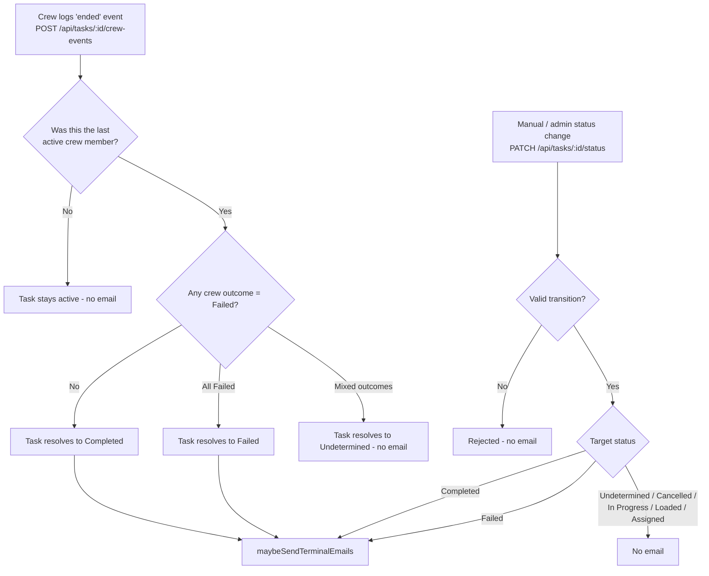
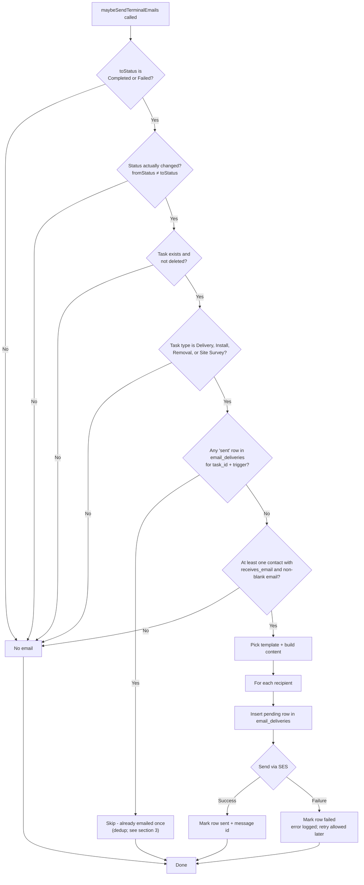

# Email sending — when emails are sent

This document describes exactly when the system sends automatic emails, based on the
implementation in `server/createTask.mjs`, `server/taskCompletionEmails.mjs`,
`server/emailDeliveries.mjs`, and `server/email.mjs`.

> **Status:** verified against the implementation and confirmed accurate after review.

## 1. What triggers the email path

There is a single entry point, `maybeSendTerminalEmails(taskId, { fromStatus, toStatus })`,
called from two places:

| # | Call site | HTTP endpoint | When it fires |
|---|-----------|---------------|---------------|
| 1 | `createCrewEvent` | `POST /api/tasks/:id/crew-events` | A crew member logs `ended` and that was the **last** crew member still working on the task. The task status then resolves to `Completed`, `Failed`, or `Undetermined`. |
| 2 | `updateTaskStatus` | `PATCH /api/tasks/:id/status` | An admin/manual status change moves the task to `Completed` or `Failed` (or `Undetermined` / `Cancelled` / active statuses — none of which email). |

Notes:

- A crew `started` event (including reopening a `Completed` task) moves the task back to
  `In Progress` / `Loaded` and never sends email by itself.
- The email check runs **after** the status change commits, outside the transaction.
  Email failures are logged and never fail the status-change request.
- Emails are only ever sent to **contacts** (`task_contacts` with `receives_email = true`),
  never to crew or internal staff.

## 2. Decision gates inside the email path

## 3. Template and trigger selection

| Task status | Task type | Template | `email_deliveries.trigger` | Subject |
|---|---|---|---|---|
| `Completed` | Delivery | `order-delivered.html` | `task_completed` | "Your order has been delivered!" |
| `Completed` | Install | `task-completed.html` | `task_completed` | "Your install is complete!" |
| `Completed` | Removal | `task-completed.html` | `task_completed` | "Your removal is complete!" |
| `Completed` | Site Survey | `task-completed.html` | `task_completed` | "Your site survey is complete!" |
| `Failed` | Delivery / Install / Removal / Site Survey | `task-failed.html` | `task_failed` | "Your {type} could not be completed" |

- `Pickup` and `Other` task types never receive automatic emails.
- Each recipient on the task gets one email per send; each attempt is a row in
  `email_deliveries` (`pending` → `sent` / `failed`).
- With `EMAIL_PROVIDER=console`, the send is logged instead of going through SES, but the
  row is still marked `sent`.

## 4. Dedup (since the re-send fix)

Before sending, the code checks `email_deliveries` for any row where
`task_id = <task> AND trigger = <trigger> AND status = 'sent'`. If one exists, the whole
blast is skipped. Consequences:

- A task that exits `Completed`/`Failed` and re-enters (crew reopen, or manual
  `Completed → Failed → Completed`) is emailed **at most once per trigger**.
- `task_completed` and `task_failed` are independent: a prior completed email does not
  suppress a later failure email (and vice versa).
- Only `sent` rows suppress. A previously `failed` row does not block a retry.

## 5. Test script (not a production trigger)

`npm run email:test` (`scripts/send-test-email.mjs`) sends a single email directly through
`dispatchOutboundEmail`, bypassing all status gates above. It exists for manual verification
only and is not invoked anywhere in production code.
