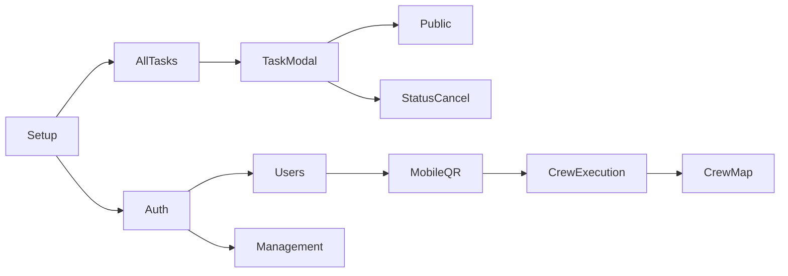

# Manual test overview

Discovery map for Field. Pick **one domain per session**, run through it, then check it off. Detailed step-by-step runbooks live in `docs/manual-test/` (one file per domain, created on demand).

**Progress:** check domains below as you complete them. Agents: mark `[x]` when the domain pass is done and note the date in **Completed**.

---

## Progress tracker

| Done | ID | Domain | Deep-dive doc |
|:----:|:---:|--------|---------------|
| - [ ] | A | Auth & permissions | — |
| - [ ] | B | Shell & navigation | — |
| - [ ] | C | All Tasks board | — |
| - [ ] | D | My Tasks (crew list) | — |
| - [ ] | E | Task detail modal | — |
| - [ ] | F | Task create & edit | — |
| - [ ] | G | Status, cancel, restore, clone | — |
| - [ ] | H | Contacts CRUD | — |
| - [ ] | I | Addresses CRUD | — |
| - [ ] | J | Users & devices | — |
| - [ ] | K | Management — org config | — |
| - [ ] | L | Import / export | — |
| - [ ] | M | Mobile QR & session | — |
| - [ ] | N | Crew task execution | — |
| - [ ] | O | Crew map | — |
| - [ ] | P | Tracking | — |
| - [ ] | Q | Email pipeline | — |
| - [ ] | R | PDF & documents | — |
| - [ ] | S | Attachments | — |
| - [ ] | T | Archive / purge | — |
| - [ ] | U | Route optimize (API only) | — |
| - [ ] | V | Dev tools | — |

**Completed:** _none yet_

---

## Shared setup

Manual tests run against **Sandbocks**, the local development org ([`docs/official-orgs.md`](official-orgs.md)). Re-run `npm run db:reset` if a prior domain mutated org settings, users, or tasks — reset also restores org catalog defaults.

```bash
cp .env.example .env
# Recommended:
# PUBLIC_APP_URL=http://localhost:5173

docker compose up -d
npm run db:schema
npm run db:reset
npm run dev
```

| Item | Value |
|------|-------|
| Org | **Sandbocks** (`COMPANY_NAME` in `.env`) |
| Web | http://localhost:5173 |
| API | http://localhost:3000 |
| Default acting user | **Logan Reed** (sidebar UserSelect) — all permissions |
| Crew-only user | **Alex Rivera** — no admin nav |
| Email | `EMAIL_PROVIDER=console` → watch API terminal |

### Optional profiles

| Profile | When needed | Add to `.env` / commands |
|---------|-------------|--------------------------|
| Maps | Addresses Places/pin; route optimize API | `GOOGLE_MAPS_API_KEY` |
| Mobile | QR activation, crew execution | `npm run adb:virtual` or `adb:physical`; `VITE_API_BASE` on physical device |
| Entra SSO | Web login variant | `VITE_AZURE_*`, `AZURE_*` |
| Google Sheets | Import workbook links | `VITE_IMPORT_GOOGLE_SHEETS={...}` |

---

## Seed data quick reference

After `npm run db:reset`:

| Entity | Count | Notes |
|--------|-------|-------|
| Users | 15 | 10 crew + 5 admins (all permissions) |
| Addresses | 18 | Las Vegas venues |
| Contacts | 8 | Fictional POCs |
| Tasks | 30 | #30 soft-deleted — must never appear in UI |

### Users

| Role | Name | Email |
|------|------|-------|
| Admin (default) | Logan Reed | logan.reed@example.com |
| Crew | Alex Rivera | alex.rivera@example.com |
| Admin alt | Nina Ortiz | nina.ortiz@example.com |

### Tasks (stable IDs)

Dates shift so Pacific **today** matches seed anchor; **#11** is always today, In Progress.

| ID | Type | Status | Use for |
|----|------|--------|---------|
| 1 | Delivery | Completed | Modal, docket PDF, public tracking, email history |
| 3 | Removal | Failed | Failed tab, failure email |
| 5, 29 | — | Cancelled | Cancelled tab |
| 6 | — | Undetermined | Undetermined tab |
| 11 | Delivery | In Progress | Crew execution, crew map, deliver flow |
| 13–14 | — | Assigned | Upcoming tab, status transitions |
| 19 | — | Unassigned | Create/compare, cancel/restore |
| 30 | — | Cancelled (deleted) | Must not appear anywhere |

**Note:** Some seeded attachment storage keys point at legacy S3 paths — downloads may 404 locally. Upload new files during tests for authoritative attachment checks.

---

## Test domains

### A — Auth & permissions

- [ ] **A** Auth & permissions

| | |
|---|---|
| **Entry** | Sidebar UserSelect; direct URLs `/management`, `/users`, `/crew-map` |
| **Acting users** | Logan Reed (admin), Alex Rivera (crew) |
| **Platform** | Desktop |
| **Depends on** | Shared setup |

**Scope:** Stub login (no Entra screen); user picker persists on refresh; admin sees Users / Management / Crew map; crew user does not; direct URL to gated pages redirects home.

---

### B — Shell & navigation

- [ ] **B** Shell & navigation

| | |
|---|---|
| **Entry** | Sidebar, bottom nav, `/settings`, `/more`, task search |
| **Platform** | Desktop + narrow viewport (<48em) |
| **Depends on** | A (optional) |

**Scope:** All nav links reach correct pages; task search opens TaskDetailModal; dark mode and larger text persist; task-type filter on Settings/More; mobile bottom nav and `/more` ↔ `/settings` redirect.

---

### C — All Tasks board

- [ ] **C** All Tasks board

| | |
|---|---|
| **Entry** | `/tasks` |
| **Acting user** | Logan Reed |
| **Platform** | Desktop |
| **Seed** | Tasks #1–29 |
| **Depends on** | Shared setup |

**Scope:** AG Grid day view; status tabs (All, In Progress, Completed, Failed, Undetermined, Upcoming, Cancelled); day/week/month views; task-type filter; column resize persists; #30 never visible.

---

### D — My Tasks (crew list)

- [ ] **D** My Tasks (crew list)

| | |
|---|---|
| **Entry** | `/my-tasks` |
| **Acting user** | Alex Rivera |
| **Platform** | Mobile viewport or Capacitor |
| **Seed** | Alex-assigned tasks (#1, #11, …) |
| **Depends on** | Shared setup |

**Scope:** List scoped to assigned crew member; cancelled tasks excluded; mobile card layout and pull-to-refresh.

---

### E — Task detail modal

- [ ] **E** Task detail modal

| | |
|---|---|
| **Entry** | Click row on `/tasks` |
| **Acting user** | Logan Reed |
| **Platform** | Desktop |
| **Seed** | #1 (completed), #11 (in progress) |
| **Depends on** | C |

**Scope:** Description, destination, contacts (POC), crew (lead), custom fields, task history, attachments section, customer tracking link.

---

### F — Task create & edit

- [ ] **F** Task create & edit

| | |
|---|---|
| **Entry** | **New Task** on `/tasks`; **Edit** in modal |
| **Platform** | Desktop only (no New Task on mobile) |
| **Test data** | Bellagio, Riley Hayes, Jamie Kim; description `QA-TEST-001` |
| **Depends on** | C |

**Scope:** Create delivery task with destination, contact, crew, schedule; edit external key; required-field validation if configured in K.

---

### G — Status, cancel, restore, clone

- [ ] **G** Status, cancel, restore, clone

| | |
|---|---|
| **Entry** | TaskDetailModal actions |
| **Seed** | #13 (assigned), #19 (unassigned), #1 (clone) |
| **Depends on** | E |

**Scope:** Admin status transitions per matrix; Failed requires notes; cancel → Cancelled tab; restore within retention window; clone creates copy.

---

### H — Contacts CRUD

- [ ] **H** Contacts CRUD

| | |
|---|---|
| **Entry** | `/contacts` |
| **Platform** | Desktop |
| **Seed** | 8 contacts; create `QA Contact` |
| **Depends on** | Shared setup |

**Scope:** Grid list; new contact; row click detail; edit; delete.

---

### I — Addresses CRUD

- [ ] **I** Addresses CRUD

| | |
|---|---|
| **Entry** | `/addresses` |
| **Platform** | Desktop |
| **Seed** | 18 venues; create `QA Warehouse` |
| **Depends on** | Shared setup; Maps profile for Places/pin |

**Scope:** Grid list; new address; detail modal; edit; delete; optional Places autocomplete and map pin.

---

### J — Users & devices

- [ ] **J** Users & devices

| | |
|---|---|
| **Entry** | `/users` |
| **Permission** | `manage_users`; desktop only |
| **Seed** | Alex Rivera for QR issue |
| **Depends on** | A |

**Scope:** User grid; create user with permissions; edit; Issue QR (`field1.…` code); Manage devices list; deactivate user (not self).

---

### K — Management — org config

- [ ] **K** Management — org config

| | |
|---|---|
| **Entry** | `/management` |
| **Permission** | `manage_org` |
| **Sections** | External key, Web sign-in, Task types, Equipment, Custom fields, Required fields, Cancel retention |
| **Depends on** | A |

**Scope:** Edit each section; save; unsaved-changes guard on navigate away; changes reflected in New Task and entity forms.

---

### L — Import / export

- [ ] **L** Import / export

| | |
|---|---|
| **Entry** | Management → **Import / export** |
| **Permission** | `manage_org` |
| **Test data** | Download sample CSV from UI, or `npm run import:sheet-spec` |
| **Depends on** | K (light) |

**Scope:** Download template/sample/current; upload CSV; preview; apply for contacts, addresses, users; export current. Optional Google Sheets link if env configured.

---

### M — Mobile QR & session

- [ ] **M** Mobile QR & session

| | |
|---|---|
| **Entry** | Users → Issue QR; Capacitor app login |
| **Platform** | Capacitor (emulator or device) |
| **Depends on** | J |

**Scope:** Issue activation code for Alex; scan/paste in deactivated app; session persists; sign out returns to activation screen.

---

### N — Crew task execution

- [ ] **N** Crew task execution

| | |
|---|---|
| **Entry** | `/task/:id`, `/task/:id/complete`, `/task/:id/deliver` |
| **Acting user** | Alex (device session) |
| **Seed** | #11 Delivery in progress |
| **Depends on** | M, D |

**Scope:** Navigate to destination; Start with GPS; End → deliver flow (photos, signature, recipient) or complete flow (notes, GPS) for non-delivery types.

---

### O — Crew map

- [ ] **O** Crew map

| | |
|---|---|
| **Entry** | `/crew-map` |
| **Permission** | `view_crew_map`; desktop only |
| **Seed** | GPS events from seed + N |
| **Depends on** | N (fresh markers) or seed alone |

**Scope:** Map loads centered on Las Vegas; pan and zoom; crew markers visible; clusters merge when zoomed out and split when zoomed in; popup shows crew/task info; viewport persists on return.

---

### P — Tracking

- [ ] **P** Tracking

| | |
|---|---|
| **Entry** | `/t/:token` (incognito) |
| **Seed** | Tracking link from task #1 |
| **Depends on** | E |

**Scope:** No login required; status headline and destination; safe history (no internal notes); document download buttons for completed task.

---

### Q — Email pipeline

- [ ] **Q** Email pipeline

| | |
|---|---|
| **Entry** | Complete or fail a task; API terminal |
| **Env** | `PUBLIC_APP_URL` for tracking CTA in email |
| **Depends on** | E or N |

**Scope:** Console email on Completed (Delivery → order-delivered; Install/Removal/Site Survey → task-completed) and Failed; recipients with `receives_email`; CLI smoke: `npm run email:test -- --task-id 1 --kind task-completed`.

---

### R — PDF & documents

- [ ] **R** PDF & documents

| | |
|---|---|
| **Entry** | TaskDetailModal → Print delivery docket; tracking page downloads |
| **Seed** | Task #1 |
| **Depends on** | E, P |

**Scope:** On-demand delivery docket PDF opens in new tab; history shows document generated; public proof/docket download from tracking page.

---

### S — Attachments

- [ ] **S** Attachments

| | |
|---|---|
| **Entry** | Task view, modal, or deliver flow |
| **Test file** | Any local `.jpg` |
| **Depends on** | E or N |

**Scope:** Upload photo; inline preview; delete; attachment appears in task list after refresh.

---

### T — Archive / purge

- [ ] **T** Archive / purge

| | |
|---|---|
| **Entry** | Cancel task; `npm run db:purge-cancelled` |
| **Setup** | Short cancel retention in K (e.g. 3 days) |
| **Depends on** | G, K |

**Scope:** Cancelled task shows archive deadline; after purge script (or expired `archive_at`), task permanently removed from Cancelled tab.

---

### U — Route optimize (API only)

- [ ] **U** Route optimize (API only)

| | |
|---|---|
| **Entry** | `POST /api/routes/optimize` (curl or devtools) |
| **Env** | `GOOGLE_MAPS_API_KEY` |
| **Depends on** | Maps profile |

**Scope:** No UI yet. Request with task IDs that have destination coordinates; response includes `orderedTaskIds` and `mapsUrl`.

---

### V — Dev tools

- [ ] **V** Dev tools

| | |
|---|---|
| **Entry** | `/development`, `/development/tests`, `/development/scripts` |
| **Build** | `import.meta.env.DEV` only |
| **Depends on** | Shared setup |

**Scope:** Development hub loads; test catalog lists Vitest cases; NPM scripts page can run scripts with output.

---

## Suggested order



1. Shared setup
2. **C** → **E** (board + modal familiarity)
3. **H**, **I**, **J**, **K**, **L** (master data & org) — any order
4. **M** → **N** → **O** (mobile + map)
5. **P**, **Q**, **R**, **S**, **T** (integrations)
6. **U**, **V** (optional)

---

## Requesting a deep-dive runbook

Ask an agent (or add the file yourself):

> Deep dive domain **O** — crew map

That produces `docs/manual-test/o-crew-map.md` with full user-voice steps and pass/fail checkboxes. Update the **Deep-dive doc** column in the progress tracker when the file exists.

---

## Known limitations

- Seeded attachment downloads may 404 locally (legacy S3 keys).
- Route optimize has no UI (domain U is API-only).
- Entra SSO is a separate variant of domain A; not required for local stub testing.
- New Task button is desktop-only.
