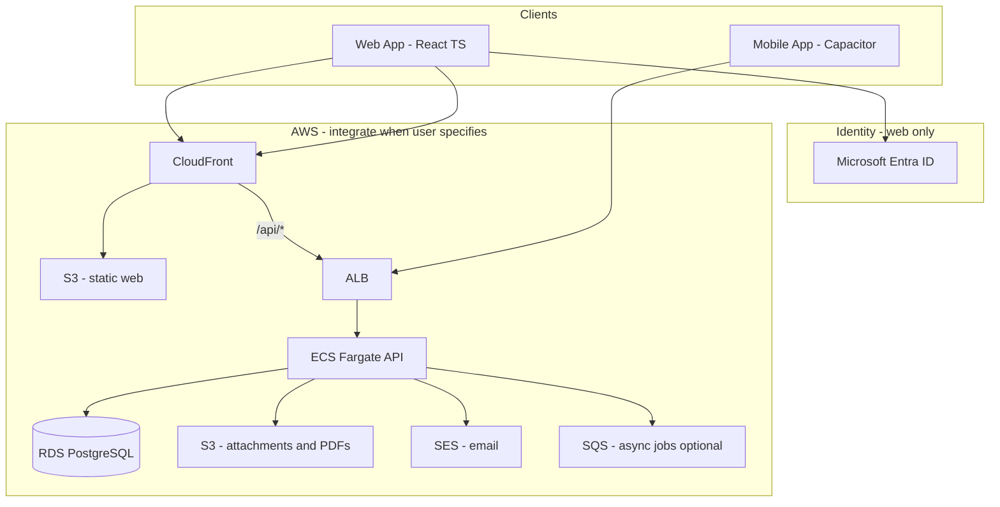
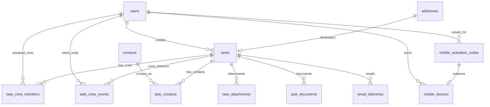

# Software Design Document (SDD)

**Project:** Field  
**Version:** 0.7 (draft)  
**Status:** Build (started) — web shell + Tasks page  
**Last updated:** 2026-07-20

---

## 1. Introduction

### 1.1 Purpose

This document describes the software design for **Field**, a field workforce management (FWM) application. It consolidates decisions captured in pre-design work and defines the architecture, domain model, and implementation boundaries sufficient to begin building.

### 1.2 Scope

Field mirrors and will eventually replace a third-party FWM product the organization currently licenses. The system supports:

- Creating and assigning **tasks** (web, authenticated)
- Executing tasks in the field (mobile, QR activation)
- Generating **PDF documents** (shipping label, delivery docket, proof of completion)
- **Automatic email** delivery tied to task events

Out of scope for this SDD: detailed UI mockups, PDF template layouts, production AWS provisioning runbooks, and licensed-product vendor identification.

### 1.3 Audience

Engineers, architects, and AI agents implementing Field. For agent quick-reference, see [`../AGENTS.md`](../AGENTS.md).

### 1.4 Related documents

| Document                                       | Contents                                            |
| ---------------------------------------------- | --------------------------------------------------- |
| [`AGENTS.md`](../AGENTS.md)                    | Agent onboarding, decisions summary, open questions |
| [`task-model.md`](task-model.md)               | Reference task export from licensed system          |
| [`database-design.md`](database-design.md)     | Full relational schema, indexes, MVP table subset   |
| [`critical-features.md`](critical-features.md) | PDF generation and automatic email requirements     |
| [`pdf-delivery-docket.md`](pdf-delivery-docket.md) | Delivery docket layout + local generator            |

---

## 2. Goals and constraints

### 2.1 Business goals

1. Ship a **minimum functioning product** that supports real delivery workflows.
2. Achieve **functional parity** with the licensed FWM product over time — mirror before innovate.
3. Reduce licensing dependency by owning the stack on **AWS**.

### 2.2 Design constraints

| Constraint          | Decision                                                              |
| ------------------- | --------------------------------------------------------------------- |
| Primary domain unit | **Task** — creators create; crew members execute                      |
| Feature discipline  | MVP-first; avoid feature creep                                        |
| Web platform        | React + TypeScript, mobile-responsive                                 |
| Mobile platform     | Capacitor (iOS/Android), same codebase, **private distribution** (shared build) |
| Web auth            | **Required** — local stub in dev; **Microsoft Entra ID** (MSAL) in production. **No Cognito.** |
| Mobile auth         | **QR activation** — durable on-device session; remotely revocable      |
| Database            | **PostgreSQL** — Docker local and/or RDS `field-dev` (us-west-1)      |
| Hosting             | **Local app**; AWS services provisioned only when requested           |

### 2.3 Development environment (local-first)

App and API run locally. **RDS PostgreSQL `field-dev`** and **S3 `field-dev-attachments`** are provisioned in `us-west-1` for cloud-backed development. Do not provision SES or other AWS resources unless requested. **Do not provision Cognito** — web auth is Microsoft Entra ID.

| Concern      | Local (current)                              | AWS / identity (current / target) |
| ------------ | -------------------------------------------- | ----------------------------- |
| Database     | Docker PostgreSQL **or** RDS `field-dev`     | **RDS `field-dev`** (us-west-1) |
| API          | `localhost`                                  | API Gateway + ECS/Lambda      |
| Web app      | Vite dev server                              | S3 + CloudFront               |
| Files / PDFs | Attachments → S3 `field-dev-attachments`; PDF scripts → `./storage/documents` | S3          |
| Web auth     | Dev auth stub or simple JWT                  | **Microsoft Entra ID** (MSAL) — not Cognito |
| Email        | **SES** via SDK (or `EMAIL_PROVIDER=console`) | SES — From `noreply@qcdlv.net` |

Use **provider abstractions** (storage, email, auth) so AWS can be swapped in without rewriting business logic. Agents must not create AWS resources unless the user explicitly requests them.

### 2.4 Critical features (non-negotiable)

These are in scope for MVP pipeline validation, not post-launch add-ons:

1. **PDF generation** — shipping label, delivery docket, POD
2. **Automatic email** — event-driven, logged, retryable

See [`critical-features.md`](critical-features.md).

---

## 3. System overview

### 3.1 Context diagram (production target)

The diagram below is the **target production architecture on AWS**. During local development, components map to localhost equivalents — see Section 2.3.



### 3.2 User roles

| Role                       | Client             | Auth                              | Primary actions                                              |
| -------------------------- | ------------------ | --------------------------------- | ------------------------------------------------------------ |
| **Task creator**           | Web                | Yes (local / Entra SSO)           | Create tasks, assign crew, view task board                   |
| **Admin**                  | Web                | Yes (local / Entra SSO)           | Manage tasks, users, documents, emails, mobile devices       |
| **Crew member**            | Mobile (Capacitor) | QR activation → device session    | View assigned tasks, update status, capture photos, complete |

The mobile app is a **shared private build** that ships **deactivated**. A crew member activates by scanning a QR issued for their user; the device keeps a durable session until revoked remotely.

### 3.3 Core workflow

```text
┌─────────────┐     ┌──────────────┐     ┌─────────────┐     ┌──────────────┐
│ Create task │ ──► │ Assign crew  │ ──► │ Execute in  │ ──► │ Complete +   │
│   (web)     │     │   (web)      │     │ field (mob) │     │ photos (mob) │
└─────────────┘     └──────────────┘     └─────────────┘     └──────────────┘
       │                    │                    │                    │
       ▼                    ▼                    ▼                    ▼
  task created         status: assigned      status: loaded /     status: completed
                       docket PDF (TBD)      in progress          POD PDF + email
```

Side effects (PDF generation, email) hook into **status transitions** and completion. Exact triggers are TBD — see Section 8.

---

## 4. Architecture

### 4.1 Style

- **Single-page web application** (React) talking to a **REST API** (backend framework TBD).
- **Monolithic API** for MVP — one deployable service with clear modules (tasks, documents, email, auth middleware).
- **Async workers** (optional SQS + Lambda or in-process queue) for PDF generation and email so task updates are not blocked.

### 4.2 Client architecture

One React + TypeScript codebase with **runtime branching**:

```text
┌─────────────────────────────────────────────────────────┐
│                  React + TypeScript App                  │
├─────────────────────────┬───────────────────────────────┤
│   Browser (web)         │   Capacitor shell (mobile)    │
│   - Login (local/Entra) │   - Deactivated until QR      │
│   - Full creator UI     │   - QR scan → durable session │
│   - Auth-gated routes   │   - Crew UI when activated    │
│   - Issue / revoke QR   │   - Remote revoke → re-scan   │
└─────────────────────────┴───────────────────────────────┘
```

Detect environment via Capacitor API (`Capacitor.isNativePlatform()`). On mobile, if no valid local session, show activation (QR scan). After activation, persist the device session token securely on device.

### 4.3 API access patterns

| Pattern        | Client    | Authentication                                 | Endpoints (examples)                              |
| -------------- | --------- | ---------------------------------------------- | ------------------------------------------------- |
| **Web API**    | Browser   | JWT (local dev auth or Entra ID)               | CRUD tasks, assign, admin, download PDFs, issue/revoke mobile |
| **Mobile API** | Capacitor | Device session token (from QR activation)      | Activate via QR, list/update **own** tasks, upload photos |

Mobile requests send the device session token (e.g. `Authorization: Bearer <deviceSessionToken>`). API resolves `userId` from the session, rejects revoked sessions with `401`, and returns only tasks where that user appears in `task_crew_members`. Do not expose mobile write endpoints without this scoping.

### 4.4 Recommended backend (proposal)

Not finalized. Recommended MVP stack for AWS alignment:

| Layer            | Proposal                                           | Rationale                                                               |
| ---------------- | -------------------------------------------------- | ----------------------------------------------------------------------- |
| API runtime      | **Node.js** on ECS Fargate or Lambda + API Gateway | TypeScript shared types with frontend; good PDF/email library ecosystem |
| ORM / migrations | **Drizzle** or **Prisma**                          | Type-safe PostgreSQL access                                             |
| PDF              | **PDFKit** or HTML → PDF (Puppeteer on Fargate)    | Template-based label/docket/POD                                         |
| Email            | **AWS SDK → SES**                                  | Native integration                                                      |

Decision deferred to implementation kickoff.

---

## 5. Domain model

### 5.1 Task-centric model

Everything supports the task lifecycle:

```text
create → assign → execute → complete | fail
```

### 5.2 Task types (seed data)

| Code          | Name        |
| ------------- | ----------- |
| `delivery`    | Delivery    |
| `install`     | Install     |
| `removal`     | Removal     |
| `site_survey` | Site Survey |
| `pickup`      | Pickup      |
| `other`       | Other       |

### 5.3 Task statuses (seed data)

| Code         | Name       | Terminal |
| ------------ | ---------- | -------- |
| `unassigned` | Unassigned | No       |
| `assigned`   | Assigned   | No       |
| `loaded`       | Loaded      | No       |
| `in_progress`  | In Progress | No       |
| `completed`    | Completed   | Yes      |
| `failed`       | Failed      | Yes      |
| `undetermined` | Undetermined | Yes    |
| `cancelled`    | Cancelled   | Yes      |

### 5.4 Status transitions (draft)

```text
unassigned    → assigned
assigned      → loaded | in_progress | failed
loaded        → in_progress | failed
in_progress   → completed | failed | undetermined
completed     → in_progress (reopen via crew start)
failed        → (terminal)
undetermined  → in_progress (reopen via crew start)
cancelled     → (terminal)
```

**Crew Start / End** (separate from admin status PATCH): each assigned crew member logs at most one `started` and one `ended` in `task_crew_events` (time + optional GPS). Task status is derived:

- First crew **Start** → `In Progress` (unless already In Progress or terminal)
- **Start** on `Completed` or `Undetermined` → reopen to `In Progress` (Delivery → `Loaded`); clears that user's prior end + note
- When every crew member who **Started** has also **Ended** → `Completed` | `Failed` | `Undetermined` from per-user outcomes (assigned crew who never started do not block)

Confirm remaining admin transitions with operations before enforcing in code.

### 5.5 Key entities

| Entity                            | Purpose                                           |
| --------------------------------- | ------------------------------------------------- |
| `users`                           | Creators, crew members, admins; web auth via Entra ID |
| `mobile_activation_codes`         | QR codes issued to activate a crew device         |
| `mobile_devices`                  | Durable mobile sessions; remote revoke            |
| `contacts`                      | Contacts (name, title, phone, email)              |
| `addresses`                       | Destination (job site) locations                  |
| `tasks`                           | Core work unit                                    |
| `task_contacts`                 | Contacts assigned to a task (0..many)             |
| `task_crew_members`               | Crew assigned to a task (0..many); one `is_lead` per task |
| `task_crew_events`                | Per-crew start/end check-ins (time + GPS)         |
| `task_attachments`                | Photos, signatures (S3)                           |
| `task_documents`                  | Generated PDFs (S3)                               |
| `email_deliveries`                | Outbound email audit log                          |

Full column definitions: [`database-design.md`](database-design.md).

### 5.6 Reference mapping

The licensed system exports a flat task record (example: delivery #12056480, status `Loaded`). Field normalizes this into related tables. Notable mappings:

- `TaskDesc` → `tasks.description` (rich crew instructions, door codes, photo requirements)
- `Destination*` → `tasks.destination_*` fields (catalog `addresses` prefills only; optional `destination_address_id`)
- `Dispatch*` → ignored — Field has no pickup address (single fixed origin)
- `RecipientName` / `Phone` / `Email` → `contacts` via `task_contacts` (0..many contacts)
- `DriverName` (reference) → join `users.display_name` as crew name (not stored on task)

Reference export: [`task-model.md`](task-model.md).

---

## 6. Data design

### 6.1 Database

- **Engine:** PostgreSQL 15+
- **Local dev:** Docker Compose or native PostgreSQL on developer machine
- **Production target:** Amazon RDS
- **Keys:** `bigint` identity for most tables; `uuid` for `users.id` (= auth subject; Entra `oid` mapped to UUID in production)
- **Timestamps:** `timestamptz`, UTC
- **Coordinates:** `numeric(10,7)` lat/lng on `addresses`

### 6.2 Entity relationship (summary)



### 6.3 API read model

The API assembles a denormalized DTO for clients (similar to the licensed export shape):

```typescript
interface TaskReadModel {
	id: number;
	taskType: string;
	status: string;
	description: string | null;
	jobTitle: string | null; // Short title separate from job description
	externalKey: string | null;
	crewMemberIds: string[];
	leadCrewMemberId: string | null;
	assignedCrew: { id: string; displayName: string; isLead: boolean }[];
	contactIds: number[];
	pocContactId: number | null;
	contacts: { id: number; name: string; title: string; phone: string; email: string; isPoc: boolean; receivesEmail: boolean }[];
	publicToken: string;
	publicTrackingPath: string;
	communicationUrl: string;
	destinationAddressId: number | null;
	destinationAddress: AddressDto | null;
	crewSize: number | null;
	estimatedHours: number | null;
	windowStartAt: string | null;
	windowEndAt: string | null;
	isTimeSpecific: boolean;
	canStartEarly: boolean;
	isUrgent: boolean;
	equipment: string[];
	completedNotes: string | null;
	completedAt: string | null;
	failedReason: string | null;
	attachments: TaskAttachmentDto[];
	documents: TaskDocumentDto[]; // shipping_label | delivery_docket | proof_of_completion (pod legacy)
	createdBy: { id: string; displayName: string };
	createdAt: string;
	updatedAt: string;
}
```

### 6.4 File storage

| Environment          | Attachments & PDFs                             | Referenced by                 |
| -------------------- | ---------------------------------------------- | ----------------------------- |
| **Local / cloud-dev** | Attachments: S3 `field-dev-attachments` (presigned PUT/GET via local API). PDF scripts: `./storage/documents` | `storage_key` (S3 object key or relative path) |
| **Production (AWS)** | S3 bucket(s)                                   | `storage_key` (S3 object key) |

Use a storage abstraction interface (`server/storage.mjs`). Attachment uploads use short-lived presigned S3 URLs; do not serve files publicly without auth checks. Bucket CORS includes Capacitor live-reload origins (`npm run s3:cors` when LAN IP changes).

---

## 7. Authentication and security

### 7.1 Web authentication

- **Local dev:** When Entra env vars are unset — stub login (user picker from `users` table). `users.id` can be seeded UUIDs.
- **Production / SSO:** Microsoft Entra ID via MSAL — `users.id` = Entra `oid` (UUID). **Amazon Cognito is not used.**
- **Flow:** SPA login via MSAL → Bearer JWT → API validates against Entra JWKS on each request
- **User sync:** `POST /api/auth/session` creates or updates the `users` row (default role `admin` on first insert)
- **Env (see `.env.example`):** `VITE_AZURE_CLIENT_ID`, `VITE_AZURE_TENANT_ID` (SPA); `AZURE_CLIENT_ID`, `AZURE_TENANT_ID` (API); optional `AZURE_API_AUDIENCE`
- **Entra app registration:** SPA platform; redirect `http://localhost:5173` (and production origin); Graph delegated `openid` `profile` `email` (+ `User.Read` if requested); admin consent as required by tenant
- **Capacitor:** Never shows Entra login; ignores these env vars for the auth gate. When API Entra vars are set, unprotected mobile calls to `/api/*` get `401` until device-session auth lands — use unset Entra vars for Cap-against-local-API during development

### 7.2 Mobile (QR activation — durable session, remotely revocable)

The Capacitor app is a **shared private build** distributed internally (MDM, sideload). Builds ship **deactivated** — no user identity is embedded at build time.

**Activation flow:**

```text
1. Admin/creator (web Users page) issues activation QR for a crew user
2. Crew opens app → More → Scan activation QR
3. App POSTs activation code to POST /api/mobile/activate
4. API validates code → creates mobile_devices row → returns deviceSessionToken + user profile
5. App stores session permanently on device (Capacitor Preferences)
6. Subsequent launches use stored session (Bearer device token)
```

**QR payload (decided):**

- Format: plain text `field1.<base64url-32-bytes>` (not a URL)
- Single-use; TTL **24 hours** from issue
- Server stores SHA-256 of the full string in `mobile_activation_codes.code_hash`

**Remote revocation:**

- Admin revokes a device (or all devices for a user) from the web app.
- API marks `mobile_devices.revoked_at` (or deletes the session).
- Next mobile request with that token returns `401`.
- App clears local storage and returns to deactivated / scan-QR UI.
- To the crew member, auth feels permanent until access is pulled remotely.

**Local session shape (on device):**

```typescript
interface MobileDeviceSession {
	deviceSessionToken: string; // opaque; presented on every API call
	userId: string; // UUID — matches users.id
	displayName: string; // shown in app header
	role: string;
	apiBaseUrl: string;
}
```

**Build approach:**

- One shared IPA/APK for all crew — not a per-person build.
- No Entra/MSAL, Cognito, password login, or build-time `userId` in Capacitor builds.
- Scan entry (MVP): More page → Scan activation QR (`@capacitor-mlkit/barcode-scanning`).

**API behavior:**

- `POST /api/mobile/activate` exchanges a valid QR payload for a device session (auth-exempt).
- `POST /api/users/:id/mobile-activations` issues a code (web auth).
- When Entra is enabled, Bearer may be an Entra JWT **or** a non-revoked device session token.
- Scope all mobile queries to tasks where `task_crew_members.user_id = userId`.
- Set `changed_by_user_id` and `uploaded_by_user_id` from the session's `userId`.
- Reject status updates on tasks not assigned to that crew member.
- Reject revoked/unknown tokens with `401`.

### 7.3 Authorization (draft)

| Action              | Web (authenticated)             | Mobile (device session)         |
| ------------------- | ------------------------------- | ------------------------------- |
| Create / edit tasks | Creator, admin                  | Deny                            |
| Assign crew         | Creator, admin                  | Deny                            |
| Issue / revoke QR   | Creator, admin                  | Deny                            |
| View assigned tasks | Any authenticated               | Own assignments only (`userId`) |
| Update task status  | Creator, assigned crew member   | Own assignments only            |
| Upload photos       | Assigned crew member            | Own assignments only            |
| Download PDFs       | Authenticated                   | Own task PDFs                   |

Implement role checks in API middleware for web routes. Mobile routes validate the device session and enforce assignment scoping.

### 7.4 Security considerations

- Treat activation QR codes like credentials — short-lived / single-use preferred; do not leave codes displayed indefinitely
- Treat device session tokens like credentials — store hashed at rest on the server; revoke on demand
- Validate status transitions server-side; do not trust client state
- Sanitize PDF/email template inputs
- SES domain verification and SPF/DKIM before production email (not needed for local Mailpit/console)

---

## 8. Critical features

### 8.1 PDF document generation

| Document        | Kind code         | Typical trigger (TBD) |
| --------------- | ----------------- | --------------------- |
| Shipping label  | `shipping_label`  | Status → `loaded`     |
| Delivery docket | `delivery_docket` | Status → `assigned`   |
| Proof of Completion | `proof_of_completion` | Status → `completed` |

**Pipeline:**

```text
Task event → API enqueues job → PDF generator reads task + attachments
    → writes PDF to storage → inserts task_documents row
```

POD incorporates `completed_notes`, `completed_at`, and `task_attachments` (photos).

### 8.2 Automatic email

**Pipeline:**

```text
Task event → API creates email_deliveries (pending) → email provider send
    → update status (sent | failed) → retry on failure
```

**Implemented:** [`server/email.mjs`](../server/email.mjs) (SES default / console) + [`server/emailDeliveries.mjs`](../server/emailDeliveries.mjs) + [`server/taskCompletionEmails.mjs`](../server/taskCompletionEmails.mjs). Manual smoke test: `npm run email:test` (`--kind order-delivered|task-completed|task-failed`). From `noreply@qcdlv.net` (domain `qcdlv.net` in us-west-1).

**Auto triggers (wired):** when a task first reaches **Completed** or **Failed** (crew end that terminalizes the task, or admin status PATCH), contacts with `receives_email` get:

| Status | Task types | Template |
| ------ | ---------- | -------- |
| Completed | Delivery | [`emails/order-delivered.html`](../emails/order-delivered.html) |
| Completed | Install, Removal, Site Survey | [`emails/task-completed.html`](../emails/task-completed.html) (type-specific headline) |
| Failed | Delivery, Install, Removal, Site Survey | [`emails/task-failed.html`](../emails/task-failed.html) (type-specific headline) |

Skipped: `Undetermined`, `Pickup`, `Other`. Sends are non-blocking (API succeeds even if SES fails; logged in `email_deliveries`).

All three templates include a customer tracking button linking to `/t/:public_token`. The link needs an absolute origin, so `PUBLIC_APP_URL` must be set; when it is unset the CTA block is stripped from the email rather than shipping a broken relative link.

**Data sources:** assigned contact emails (`contacts` via `task_contacts`), task fields, links to PDFs.

**Draft trigger matrix** (remaining / confirm with operations):

| Event          | Email purpose                         |
| -------------- | ------------------------------------- |
| Task assigned  | Internal / crew notification          |
| Task loaded    | Warehouse / dispatch                  |
| Task completed | Completion notice to contact (wired) |
| Task failed    | Failure notice to contact (wired) |

### 8.3 MVP bar for documents and email

Before considering the pipeline complete:

1. At least **one PDF type** generating from real task data
2. At least **one automatic email** on a defined event
3. All outputs logged in `task_documents` / `email_deliveries`

---

## 9. API design (high-level)

Backend framework and OpenAPI spec are **not yet written**. Planned resource groups:

### 9.1 Web endpoints (JWT required)

| Group                  | Operations                          |
| ---------------------- | ----------------------------------- |
| `/tasks`               | List, create, get, update, assign   |
| `/tasks/:id/status`    | Transition status (with validation) |
| `/tasks/:id/crew-events` | Log crew start/end (time + GPS)   |
| `/tasks/:id/documents` | List, generate, download PDFs       |
| `/users`               | List crew members, manage (admin)   |
| `/contacts`          | CRUD contacts                       |

### 9.2 Mobile endpoints (device session; activation before use)

| Group                           | Operations                                      |
| ------------------------------- | ----------------------------------------------- |
| `/mobile/activate`              | Exchange QR activation code for device session  |
| `/mobile/tasks`                 | List tasks assigned to session `userId`         |
| `/mobile/tasks/:id`             | Get task detail (403 if not assigned to caller) |
| `/mobile/tasks/:id/crew-events` | Log start/end for session user                  |
| `/mobile/tasks/:id/attachments` | Upload photo (presigned URL flow)               |

`/mobile/activate` is unauthenticated (code is the credential). All other mobile endpoints require a valid, non-revoked device session token.

**Web admin (related):**

| Group                         | Operations                                      |
| ----------------------------- | ----------------------------------------------- |
| `/users/:id/mobile-activations` | Issue activation QR / code for a crew user    |
| `/users/:id/mobile-devices`     | List devices; revoke one or all               |

### 9.3 Shared conventions

- JSON request/response bodies
- ISO 8601 timestamps in UTC
- `409 Conflict` on invalid status transition
- Pagination on list endpoints (`cursor` or `offset` — decide at implementation)
- Errors: `{ "error": string, "code": string }`

---

## 10. Client applications

### 10.1 Web application

- **Stack:** React 18+, TypeScript, Vite, React Router, lucide-react
- **Scaffold status:** Underway — app shell (hamburger + left nav) and **Tasks** page with mock data grid; auth and API not wired yet
- **Auth:** Local dev login (production: Microsoft Entra ID via MSAL)
- **Views (MVP):** Login, task list/board, task create/edit, task detail, assign crew, PDF download
- **Responsive:** Mobile-first shell; usable on phone through desktop

### 10.2 Mobile application (Capacitor)

- **Stack:** Same React build inside Capacitor 6+
- **Plugins (anticipated):** Camera / barcode (QR), Filesystem, optional Push Notifications
- **Views (MVP):** Activation (QR scan), task list (assigned), task detail, status actions, camera capture
- **Distribution:** One **shared private build**; MDM or sideload — ships deactivated
- **Auth UX:** Deactivated until valid QR; then durable local session until remote revoke

### 10.3 Build and release flow

**Web (shared build):**

```text
1. npm run dev             → Vite dev server (local)
2. npm run build           → web assets for creators/dispatch
```

**Mobile (shared private build):**

```text
1. npm run build:mobile   → Capacitor web bundle (no per-user env)
2. npx cap sync           → copy into iOS/Android project
3. Build IPA/APK          → distribute to crew (MDM / sideload)
4. On device              → scan activation QR issued from web for that user
```

For local dev, simulate activation with a test code or a mocked QR payload against the local API. Automate Cap sync / native builds when ready — **not** one binary per crew member.

AWS deploy (S3/CloudFront for web) happens only when the user directs integration.

---

## 11. Infrastructure

### 11.1 Local development (current)

App, API, storage, email, and auth run on the developer machine. Database may be local Docker **or** the provisioned RDS instance:

| Component | Local setup                                         |
| --------- | --------------------------------------------------- |
| Database  | Docker Compose **or** RDS `field-dev` (us-west-1)   |
| API       | Node process on `localhost:3000` (port TBD)         |
| Web       | Vite on `localhost:5173`                            |
| Storage   | Attachments → S3 `field-dev-attachments`; PDF scripts → `./storage/documents` |
| Email     | SES SDK (`EMAIL_PROVIDER=ses`) or console           |
| Auth      | Dev user seed + local JWT                           |

Connection placeholders: [`.env.example`](../.env.example).

### 11.2 AWS

| Component          | Service                                 | Status / notes                                       |
| ------------------ | --------------------------------------- | ---------------------------------------------------- |
| Database           | RDS PostgreSQL `field-dev`              | **Provisioned** — us-west-1, `db.t4g.micro`, Single-AZ, 20 GB gp3, public + IP-locked SG |
| Secrets            | Secrets Manager                         | Master password for `field-dev`                      |
| Static web hosting | S3 + CloudFront                         | **CDK ready** — staging stack [`infra/`](../infra/); generic `*.cloudfront.net` URL (no custom DNS yet). See [`staging.md`](staging.md). |
| API                | ALB + ECS Fargate                       | **CDK ready** — same staging stack; path `/api/*` via CloudFront. Lambda kept for Wodely sync only. |
| Auth               | Microsoft Entra ID (MSAL)               | Not yet (web only; Cognito out of scope); staging smoke uses local stub |
| Object storage     | S3 `field-dev-attachments`          | **Provisioned** (dev) — private, SSE-S3, CORS for web + Capacitor live reload (+ staging origin after deploy) |
| Email              | SES                                     | **In use (dev)** — domain `qcdlv.net`, From `noreply@qcdlv.net`, config set `notify_on_error` |
| Async jobs         | SQS + Lambda _(optional)_               | Not yet                                              |
| DNS / TLS          | Route 53 + ACM                          | Blocked — staging uses CloudFront default cert/hostname |

**`field-dev` details:** identifier `field-dev`, DB name `field`, user `field_admin`, endpoint in `.env.example`. Security group `field-dev-db-sg` allows TCP 5432 from the developer public IP; staging CDK adds ingress from the ECS task SG. MVP tables via [`db/migrations/`](../db/migrations/) (empty — no seed data). Fresh DB: `npm run db:schema`. Incremental: `npm run db:schema -- db/migrations/<file>.sql`.

### 11.3 Environments

| Environment | Purpose                                           |
| ----------- | ------------------------------------------------- |
| `dev`       | Local machine; Docker PostgreSQL and/or RDS `field-dev` |
| `staging`   | AWS smoke test — CloudFront generic URL; CDK stack `FieldStaging` ([`staging.md`](staging.md)) |
| `prod`      | AWS live (when integrated)                        |

Infrastructure as Code: **AWS CDK** under [`infra/`](../infra/). `field-dev` RDS/S3/SES were created earlier via AWS CLI; staging compute/CDN is CDK.

### 11.4 AWS MVP stack (when integrating)

RDS, attachments S3, and SES are in use. Staging CDK (not yet provisioned until approved): CloudFront + S3 web + ALB + ECS Fargate, reusing `field-dev` data plane. Web auth remains Entra ID (not Cognito). Add SQS when PDF/email async is implemented. Custom domain when DNS is unblocked.

---

## 12. MVP scope

### 12.1 In scope

| Area     | MVP deliverable                                                       |
| -------- | --------------------------------------------------------------------- |
| Web auth | Local dev login; Microsoft Entra ID SSO (not Cognito)                 |
| Tasks    | Create, assign, list, view, status updates                            |
| Mobile   | QR activation, crew task list, status update, photo upload (Capacitor) |
| Data     | Core tables per [`database-design.md`](database-design.md) MVP subset |
| PDF      | At least one type (recommend: **delivery docket** first)              |
| Email    | At least one automatic send (recommend: **completion → contact**)   |
| Audit    | `email_deliveries` logging; crew timeline via `task_crew_events` |

### 12.2 Explicitly deferred

| Item                             | Reason                                  |
| -------------------------------- | --------------------------------------- |
| `task_line_items`                | Materials in `description` text for now |
| `contact_addresses`              | Deferred — contacts and addresses stay separate |
| Public app store mobile release  | Private distribution only               |
| SMS notifications                | Email only for now                      |
| Offline-first mobile             | Not required unless requirements change |
| Integrations (payroll, CRM, GPS) | Post-MVP                                |

### 12.3 Suggested implementation order

1. **Foundation** — repo scaffold, Docker PostgreSQL, schema migrations, local auth stub, API health
2. **Task CRUD (web)** — create, list, view, assign
3. **Status workflow** — transitions in app code; crew start/end via `task_crew_events`
4. **Mobile crew flow** — Capacitor build, QR activation, task list, status, photo upload
5. **PDF pipeline** — one template, local `./storage/documents`
6. **Email pipeline** — SES + `email_deliveries`; Completed/Failed auto emails for Delivery + Install/Removal/Site Survey
7. **Remaining PDFs and email triggers** — expand matrix
8. **AWS integration** — when user specifies; swap providers (S3, SES); web auth remains Entra ID

Implement **vertical slices** (UI → API → DB → storage) per step, not horizontal layers.

---

## 13. Non-functional requirements

| Requirement     | Target (MVP)                                           |
| --------------- | ------------------------------------------------------ |
| Availability    | Best effort; single region                             |
| Performance     | Task list < 2s on mobile LTE                           |
| Data durability | Local: Docker volume; AWS: RDS backups + S3            |
| Timezone        | Store UTC; display in local TZ on client               |
| Browser support | Latest Chrome, Edge, Safari                            |
| Mobile OS       | Current iOS and Android (Capacitor supported versions) |

---

## 14. Risks and open issues

### 14.1 Open issues (must resolve during build)

| #   | Issue                                       | Impact               |
| --- | ------------------------------------------- | -------------------- |
| O1  | ~~QR payload format, expiry, one-time vs multi-use~~ **Decided:** `field1.<base64url>`, single-use, 24h | — |
| O2  | One mobile device per user vs multiple           | Operations           |
| O3  | PDF/email trigger matrix                    | Feature completeness |
| O4  | PDF template layouts                        | Document quality     |
| O5  | Backend runtime choice (Lambda vs ECS)      | **Decided:** ECS Fargate + ALB for API; Lambda for Wodely/async |
| O6  | Status transition confirmation              | Business logic       |
| O7  | Address picker UX (free-text create vs select existing) | UX / schema          |
| O8  | Licensed product name/vendor                | Parity validation    |

### 14.2 Risks

| Risk                                            | Mitigation                                                                  |
| ----------------------------------------------- | --------------------------------------------------------------------------- |
| Unauthenticated / stolen QR or session abused   | Short-lived/single-use codes; hashed device tokens; remote revoke; rate limiting |
| Single codebase web/mobile diverges in behavior | Strict runtime detection; shared components; separate route configs         |
| PDF/email blocks task updates                   | Async queue from day one                                                    |
| Scope creep beyond licensed parity              | Task-first scoping rule; SDD change control                                 |
| Capacitor limits (offline, native UX)           | Document tradeoffs; revisit React Native only if required                   |

---

## 15. Document history

| Version | Date       | Author | Changes                                                    |
| ------- | ---------- | ------ | ---------------------------------------------------------- |
| 0.1     | 2026-07-15 | —      | Initial SDD synthesized from pre-design docs               |
| 0.2     | 2026-07-15 | —      | Local-first development; AWS deferred until user specifies |
| 0.3     | 2026-07-15 | —      | Mobile: per-executor private builds with embedded identity |
| 0.4     | 2026-07-16 | —      | RDS `field-dev` provisioned in us-west-1 for cloud-backed local development |
| 0.5     | 2026-07-16 | —      | Removed teams — crew-member assignment only                                |
| 0.6     | 2026-07-16 | —      | Terminology: "driver" → "crew member"; `assigned_crew_user_id`             |
| 0.7     | 2026-07-20 | —      | Mobile auth: shared build + QR activation; durable session; remote revoke  |

---

## Appendix A: Glossary

| Term          | Definition                                                        |
| ------------- | ----------------------------------------------------------------- |
| **Task**         | Unit of field work — created by office staff, executed by crew |
| **Crew member**  | Field worker who performs a task (not called "driver" in Field) |
| **POD**          | Proof of delivery — PDF documenting completion                 |
| **Docket**       | Delivery instruction packet for the crew                       |
| **Contact** | Venue or client receiving delivery                                |
| **Capacitor** | Native shell wrapping the web app for iOS/Android                 |
