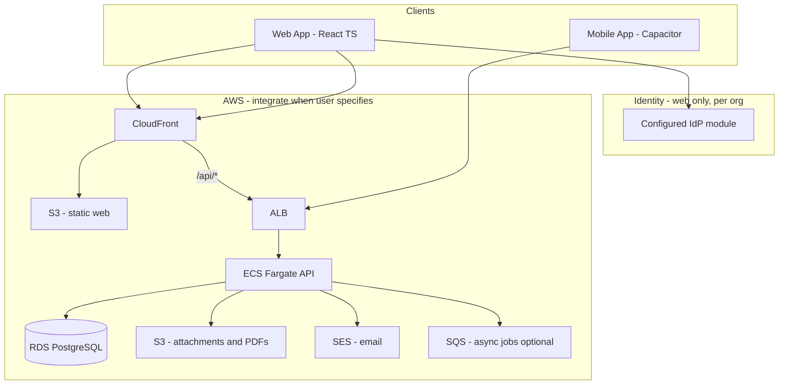
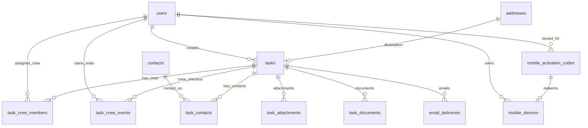

# Software Design Document (SDD)

**Project:** Field  
**Version:** 0.8 (draft)  
**Status:** Build (started) — web shell + Tasks page  
**Last updated:** 2026-08-12

---

## 1. Introduction

### 1.1 Purpose

This document describes the software design for **Field**, a field workforce management (FWM) application. It consolidates decisions captured in pre-design work and defines the architecture, domain model, and implementation boundaries.

### 1.2 Scope

Field supports:

- Creating and assigning **tasks** (web, authenticated)
- Executing tasks in the field (mobile, QR activation)
- Generating **PDF documents** (shipping label, delivery docket, proof of completion)
- **Automatic email** delivery tied to task events
- **Automatic text** also applied to task events (Not yet implemented)

Out of scope for this SDD: detailed UI mockups, PDF template layouts, production AWS provisioning runbooks, and licensed-product vendor identification.

### 1.3 Audience

For agent quick-reference, see [`../AGENTS.md`](../AGENTS.md).

### 1.4 Related documents

| Document                                       | Contents                                            |
| ---------------------------------------------- | --------------------------------------------------- |
| [`database-design.md`](database-design.md)     | Full relational schema, indexes, MVP table subset   |
| [`official-orgs.md`](official-orgs.md)         | Sandbocks (dev) and Alpha Industries (assurance)    |
| [`auth.md`](auth.md)     | undefined   |
| [`print-templates.md`](print-templates.md)     | undefined   |

---

## 2. Goals and constraints

### 2.1 Business goals

1. Ship a **minimum functioning product** that supports real workflows.
2. Achieve **functional parity** with market competitors, meaning mirror before innovate.
3. Reduce licensing dependency by owning the stack on **AWS**.

### 2.2 Design constraints

| Constraint          | Decision                                                              |
| ------------------- | --------------------------------------------------------------------- |
| Primary domain unit | **Task** — users create and execute                      |
| Feature discipline  | MVP-first; avoid feature creep                                        |
| Web platform        | React + TypeScript, mobile-responsive                                 |
| Mobile platform     | Capacitor (iOS/Android), same codebase, public distribution not yet implemented (shared build) |
| Web auth            | **Required** — local stub in dev; **pluggable identity providers** per org (Entra module first). See [`auth.md`](auth.md). |
| Mobile auth         | **QR activation** — durable on-device session; remotely revocable      |
| Database            | **PostgreSQL** — Docker Compose (default)                             |
| Hosting             | **Local app**; AWS services provisioned only when requested           |

### 2.3 Development environment (local-first)

App and API run locally with **no AWS dependency by default**: Docker Postgres, local file storage (`./storage/`), and `EMAIL_PROVIDER=console`. Optional cloud resources (S3, SES, RDS) are configured via `.env` when you provision them in a future pass. Web auth uses provider modules — see [`auth.md`](auth.md).

| Concern      | Local (default)                              | Cloud (future — TBD)        |
| ------------ | -------------------------------------------- | ----------------------------- |
| Database     | Docker PostgreSQL (`docker compose up -d`)   | Your PostgreSQL when chosen   |
| API          | `localhost:3000`                             | ECS/Lambda or equivalent      |
| Web app      | Vite dev server                              | S3 + CloudFront or equivalent |
| Files / PDFs | `./storage/attachments` + `./storage/documents` | S3 when `S3_BUCKET` set  |
| Web auth     | Dev auth stub or configured IdP (Entra module) | Per-org identity source(s) — see [`auth.md`](auth.md) |
| Email        | **`EMAIL_PROVIDER=console`**                 | SES when configured           |

Use **provider abstractions** (storage, email, auth) so AWS can be swapped in without rewriting business logic. Agents must not create AWS resources unless the user explicitly requests them.

**Official organizations:** Local development runs as **Sandbocks** (org defaults, disposable seed data via `npm run db:reset`). **Alpha Industries** is a separate future deployment for independent assurance with automated random-event simulation — provisioned only after hosted infrastructure exists. See [`official-orgs.md`](official-orgs.md).

### 2.4 Critical features (non-negotiable)

These are in scope for MVP pipeline validation, not post-launch add-ons:

1. **PDF generation** — shipping label, delivery docket, POD
2. **Automatic email** — event-driven, logged, retryable
3. **100% Test Coverage** - including manual e2e testing

See [`critical-features.md`](critical-features.md).

---

## 3. System overview

### 3.1 Context diagram (production target)

The diagram below is the **target production architecture on AWS**. During local development, components map to localhost equivalents — see Section 2.3.



### 3.2 Users and access

`users.role` is a **human-interpreted label** (job title, team name). It is never used to grant or deny access.

| Access | Who | What |
| ------ | --- | ---- |
| **Standard (web)** | Any authenticated web user | Create/assign tasks, task boards, contacts, addresses |
| **Standard (mobile)** | QR device session | Assigned tasks, status, photos, complete |
| **`manage_users`** | Extra key | Users page, issue/revoke mobile devices, PATCH user role/permissions |
| **`manage_org`** | Extra key | Management page, `PUT /api/org/settings` |
| **`view_crew_map`** | Extra key | Crew map (desktop) |

New users from any web identity provider get an empty role and no extra keys. If nobody in the database has `manage_users`, the first insert is granted all extra keys so the org is not locked out.

The mobile app is a **shared private build** that ships **deactivated**. A crew member activates by scanning a QR issued for their user; the device keeps a durable session until revoked remotely.

### 3.3 Core workflow

```text
┌─────────────┐     ┌──────────────┐     ┌─────────────┐     ┌──────────────┐
│ Create task │ ──► │ Assign crew  │ ──► │ Execute in  │ ──► │ Complete +   │
│   (web)     │     │   (web)      │     │ field (mob) │     │ photos (mob) │
└─────────────┘     └──────────────┘     └─────────────┘     └──────────────┘
       │                    │                    │                    │
       ▼                    ▼                    ▼                    ▼
  task created         status: assigned      status: loaded /     status: completed
                       docket PDF (TBD)      in progress          POD PDF + email
```

Side effects (PDF generation, email) hook into **status transitions** and completion. Exact triggers are TBD — see Section 8.

---

## 4. Architecture

### 4.1 Style

- **Single-page web application** (React) talking to a **REST API** (backend framework TBD).
- **Monolithic API** for MVP — one deployable service with clear modules (tasks, documents, email, auth middleware).
- **Async workers** (optional SQS + Lambda or in-process queue) for PDF generation and email so task updates are not blocked.

### 4.2 Client architecture

One React + TypeScript codebase with **runtime branching**:

```text
┌─────────────────────────────────────────────────────────┐
│                  React + TypeScript App                  │
├─────────────────────────┬───────────────────────────────┤
│   Browser (web)         │   Capacitor shell (mobile)    │
│   - Login (stub / IdP)  │   - Deactivated until QR      │
│   - Full creator UI     │   - QR scan → durable session │
│   - Auth-gated routes   │   - Crew UI when activated    │
│   - Issue / revoke QR   │   - Remote revoke → re-scan   │
└─────────────────────────┴───────────────────────────────┘
```

Detect environment via Capacitor API (`Capacitor.isNativePlatform()`). On mobile, if no valid local session, show activation (QR scan). After activation, persist the device session token securely on device.

### 4.3 API access patterns

| Pattern        | Client    | Authentication                                 | Endpoints (examples)                              |
| -------------- | --------- | ---------------------------------------------- | ------------------------------------------------- |
| **Web API**    | Browser   | JWT from configured web IdP (or dev stub)      | CRUD tasks, assign, admin, download PDFs, issue/revoke mobile |
| **Mobile API** | Capacitor | Device session token (from QR activation)      | Activate via QR, list/update **own** tasks, upload photos |

Mobile requests send the device session token (e.g. `Authorization: Bearer <deviceSessionToken>`). API resolves `userId` from the session, rejects revoked sessions with `401`, and returns only tasks where that user appears in `task_crew_members`. Do not expose mobile write endpoints without this scoping.

### 4.4 Recommended backend (proposal)

Not finalized. Recommended MVP stack for AWS alignment:

| Layer            | Proposal                                           | Rationale                                                               |
| ---------------- | -------------------------------------------------- | ----------------------------------------------------------------------- |
| API runtime      | **Node.js** on ECS Fargate or Lambda + API Gateway | TypeScript shared types with frontend; good PDF/email library ecosystem |
| ORM / migrations | **Drizzle** or **Prisma**                          | Type-safe PostgreSQL access                                             |
| PDF              | **PDFKit** or HTML → PDF (Puppeteer on Fargate)    | Template-based label/docket/POD                                         |
| Email            | **AWS SDK → SES**                                  | Native integration                                                      |

Decision deferred to implementation kickoff.

---

## 5. Domain model

### 5.1 Task-centric model

Everything supports the task lifecycle:

```text
create → assign → execute → complete | fail
```

### 5.2 Task types (seed data)

| Code          | Name        |
| ------------- | ----------- |
| `delivery`    | Delivery    |
| `install`     | Install     |
| `removal`     | Removal     |
| `site_survey` | Site Survey |
| `pickup`      | Pickup      |
| `other`       | Other       |

### 5.3 Task statuses (seed data)

| Code         | Name       | Terminal |
| ------------ | ---------- | -------- |
| `unassigned` | Unassigned | No       |
| `assigned`   | Assigned   | No       |
| `loaded`       | Loaded      | No       |
| `in_progress`  | In Progress | No       |
| `completed`    | Completed   | Yes      |
| `failed`       | Failed      | Yes      |
| `undetermined` | Undetermined | Yes    |
| `cancelled`    | Cancelled   | Yes      |

The PG enum also retains a legacy `Created` value from the baseline schema (`001`/`005`) —
nothing sets it.

### 5.4 Status transitions (as implemented)

Manual transitions are enforced by `PATCH /api/tasks/:id/status` (`server/createTask.mjs` → `updateTaskStatus`) against the tables in [`shared/statusTransitions.js`](../shared/statusTransitions.js); the task detail UI renders the same tables. Delivery has its own table (`Loaded` is the active-work status, same role as `In Progress`); all other task types share a second table.

**Non-Delivery (Install, Removal, Site Survey, Pickup, Other) — manual PATCH:**

```text
unassigned    → assigned
assigned      → loaded | in_progress | failed
loaded        → in_progress | failed
in_progress   → completed | failed | undetermined
completed     → in_progress | failed | undetermined
failed        → completed | undetermined
undetermined  → completed | failed
```

**Delivery — manual PATCH:**

```text
unassigned    → assigned
assigned      → loaded | failed
loaded        → completed | failed | undetermined
in_progress   → completed | failed | undetermined
completed     → loaded
failed        → (terminal)
undetermined  → (terminal)
```

**Crew Start / End** (separate from admin status PATCH; `server/createTask.mjs` → `createCrewEvent`): each assigned crew member logs at most one `started` and one `ended` in `task_crew_events` (time + optional GPS). Task status is derived:

- First crew **Start** → `In Progress` (Delivery → `Loaded`) unless already at that status or terminal
- **Start** on `Completed` or `Undetermined` → reopen to `In Progress` (Delivery → `Loaded`); clears that user's prior end + completion note
- **Start**/**End** on `Failed` or `Cancelled` → rejected (`409`) — `Failed` is terminal for crew events even though non-Delivery manual PATCH can move it
- When every crew member who **Started** has also **Ended** → `Completed` | `Failed` | `Undetermined` from per-user outcomes (assigned crew who never started do not block)

**Cancel / restore:** `DELETE /api/tasks/:id` cancels from any status (`Cancelled`, force-ending open crew starts); `POST /api/tasks/:id/restore` restores a cancelled task as `Undetermined` within the 7-day window.

These rules are enforced today; confirm the remaining admin transitions with operations before changing them.

### 5.5 Key entities

| Entity                            | Purpose                                           |
| --------------------------------- | ------------------------------------------------- |
| `users`                           | Creators, crew members, admins; web auth via configured identity provider |
| `mobile_activation_codes`         | QR codes issued to activate a crew device         |
| `mobile_devices`                  | Durable mobile sessions; remote revoke            |
| `contacts`                      | Contacts (name, title, phone, email)              |
| `addresses`                       | Destination (job site) locations                  |
| `tasks`                           | Core work unit                                    |
| `task_contacts`                 | Contacts assigned to a task (0..many)             |
| `task_crew_members`               | Crew assigned to a task (0..many); one `is_lead` per task |
| `task_crew_events`                | Per-crew start/end check-ins (time + GPS)         |
| `task_attachments`                | Photos, signatures (S3)                           |
| `task_documents`                  | Generated PDFs (S3)                               |
| `email_deliveries`                | Outbound email audit log                          |

Full column definitions: [`database-design.md`](database-design.md).

### 5.6 Reference mapping

The licensed system exports a flat task record (example: delivery #12056480, status `Loaded`). Field normalizes this into related tables. Notable mappings:

- `TaskDesc` → `tasks.description` (rich crew instructions, door codes, photo requirements)
- `Destination*` → `tasks.destination_*` fields (catalog `addresses` prefills only; optional `destination_address_id`)
- `Dispatch*` → ignored — Field has no pickup address (single fixed origin)
- `RecipientName` / `Phone` / `Email` → `contacts` via `task_contacts` (0..many contacts)
- `DriverName` (reference) → join `users.display_name` as crew name (not stored on task)

Reference export: [`task-model.md`](task-model.md).

---

## 6. Data design

### 6.1 Database

- **Engine:** PostgreSQL 15+
- **Local dev:** Docker Compose or native PostgreSQL on developer machine
- **Production target:** Amazon RDS
- **Keys:** `bigint` identity for most tables; `uuid` for `users.id` (= auth subject from the org's IdP; e.g. Entra `oid` mapped to UUID)
- **Timestamps:** `timestamptz`, UTC
- **Coordinates:** `numeric(10,7)` lat/lng on `addresses`

### 6.2 Entity relationship (summary)



### 6.3 API read model

The API assembles a denormalized DTO for clients (similar to the licensed export shape):

```typescript
interface TaskReadModel {
	id: number;
	taskType: string;
	status: string;
	description: string;
	jobTitle: string;
	externalKey: string;
	destinationAddressId: number | null;
	destinationAddressName: string;
	destinationAddress: string;
	destinationBuilding: string;
	destinationNotes: string;
	contacts: { id: number; name: string; title: string; phone: string; email: string; isPoc: boolean; receivesEmail: boolean }[];
	customFields: Record<string, string | number | boolean | null>;
	customFieldDisplays: Record<string, string>;
	isTimeSpecific: boolean;
	canStartEarly: boolean;
	isUrgent: boolean;
	windowStartAt: string | null;
	windowEndAt: string | null;
	completedNotes: string | null;
	completedAt: string | null;
	failedReason: string | null;
	cancelledAt: string | null;
	completionNotes: { userId: string; displayName: string; outcome: 'Completed' | 'Failed'; notes: string | null; createdAt: string; updatedAt: string }[];
	completionNotesByName: string | null;
	createdAt: string;
	updatedAt: string;
	createdByName: string;
	trackingToken: string;
	trackingPath: string;
	trackingUrl: string;
	crewMembers: { id: string; displayName: string; isLead: boolean; startedAt: string | null; endedAt: string | null }[];
	attachments: TaskAttachmentDto[]; // merged into GET /api/tasks/:id responses
}
```

This matches the shape returned by `GET /api/tasks/:id` (see [`src/types/task.ts`](../src/types/task.ts)). Notes:

- Crew check-in times come from `task_crew_events` (`startedAt` / `endedAt` per member).
- `documents` (`task_documents`) is **not** included in the detail payload — generated PDFs are served via `GET /api/tasks/:id/delivery-docket` and `GET /api/tracking/tasks/:token/documents/:kind`.
- List responses (`GET /api/tasks`) return a slimmer row shape, not this detail DTO.

### 6.4 File storage

| Environment          | Attachments & PDFs                             | Referenced by                 |
| -------------------- | ---------------------------------------------- | ----------------------------- |
| **Local / cloud-dev** | Attachments: `./storage/attachments` (default) or S3 when configured. PDF scripts: `./storage/documents` | `storage_key` (relative path or S3 object key) |
| **Production (AWS)** | S3 bucket(s)                                   | `storage_key` (S3 object key) |

Use a storage abstraction interface (`server/storage.mjs`). Attachment uploads use short-lived presigned S3 URLs; do not serve files publicly without auth checks. Bucket CORS includes Capacitor live-reload origins (`npm run s3:cors` when LAN IP changes).

---

## 7. Authentication and security

### 7.1 Web authentication

See [`auth.md`](auth.md) for the full provider model. Summary:

- **Local dev:** When no IdP is configured — stub login (user picker from `users` table). `users.id` can be seeded UUIDs.
- **Production / SSO:** Per-org **identity source** — modular client + API verify + user upsert. **Microsoft Entra ID** (MSAL) is the first implemented module; others follow the same contract.
- **Flow:** SPA login via provider module → Bearer JWT → API validates token and maps claims to `users.id`
- **User sync:** `POST /api/auth/session` creates or updates the `users` row (empty role + empty permissions on first insert; bootstrap all extra keys if nobody has `manage_users`)
- **Entra module env:** `VITE_AZURE_CLIENT_ID`, `VITE_AZURE_TENANT_ID` (SPA); `AZURE_CLIENT_ID`, `AZURE_TENANT_ID` (API); optional `AZURE_API_AUDIENCE` — single-tenant shortcut until per-org config exists
- **Capacitor:** Never shows web SSO; ignores IdP env vars for the auth gate. When web auth is enabled on the API, every `/api/*` request needs a valid bearer token — a web JWT or a non-revoked mobile device session token (see §7.2). With no provider configured (local dev), `requireWebAuth` is a no-op and the API is unauthenticated.

### 7.2 Mobile (QR activation — durable session, remotely revocable)

The Capacitor app is a **shared private build** distributed internally (MDM, sideload). Builds ship **deactivated** — no user identity is embedded at build time.

**Activation flow:**

```text
1. A web user with `manage_users` issues an activation QR for a user
2. Crew opens app → More → Scan activation QR
3. App POSTs activation code to POST /api/mobile/activate
4. API validates code → creates mobile_devices row → returns deviceSessionToken + user profile
5. App stores session permanently on device (Capacitor Preferences)
6. Subsequent launches use stored session (Bearer device token)
```

**QR payload (decided):**

- Format: plain text `field1.<base64url-32-bytes>` (not a URL)
- Single-use; TTL **24 hours** from issue
- Server stores SHA-256 of the full string in `mobile_activation_codes.code_hash`

**Remote revocation:**

- Admin revokes a device (or all devices for a user) from the web app.
- API marks `mobile_devices.revoked_at` (or deletes the session).
- Next mobile request with that token returns `401`.
- App clears local storage and returns to deactivated / scan-QR UI.
- To the crew member, auth feels permanent until access is pulled remotely.

**Local session shape (on device):**

```typescript
interface MobileDeviceSession {
	deviceSessionToken: string; // opaque; presented on every API call
	userId: string; // UUID — matches users.id
	displayName: string; // shown in app header
	role: string; // label only
	permissions: string[];
	apiBaseUrl: string;
}
```

**Build approach:**

- One shared IPA/APK for all crew — not a per-person build.
- No web SSO (any IdP), password login, or build-time `userId` in Capacitor builds.
- Scan entry (MVP): More page → Scan activation QR (`@capacitor-mlkit/barcode-scanning`).

**API behavior:**

- `POST /api/mobile/activate` exchanges a valid QR payload for a device session (auth-exempt).
- `POST /api/users/:id/mobile-activations` issues a code (web auth).
- When web auth is enabled, Bearer may be a web IdP JWT **or** a non-revoked device session token.
- Scope all mobile queries to tasks where `task_crew_members.user_id = userId`.
- Attribute mobile writes to the session's `userId` — status authors and crew events use it; photo `uploaded_by_user_id` is still caller-declared (not yet session-bound).
- Reject status updates on tasks not assigned to that crew member.
- Reject revoked/unknown tokens with `401`.

### 7.3 Authorization (as implemented)

Web (IdP JWT) cells reflect current behavior — task routes have no creator/assignment middleware for web sessions. Extra surfaces use `users.permissions` keys, not `users.role`. Mobile cells marked **intent** are documented targets that are **not yet** enforced (the remaining scoping gaps; see §9.2 / §12). When no web IdP is configured (local dev), `requireWebAuth` is a no-op and the API is unauthenticated.

| Action               | Web (IdP JWT)                    | Mobile (device session)                                          | Enforced |
| -------------------- | -------------------------------- | ---------------------------------------------------------------- | -------- |
| Create / edit tasks  | Any authenticated                | Deny (intent) — shared `POST/PUT /api/tasks` routes              | ✗        |
| Assign crew          | Any authenticated                | Deny (intent) — part of create/update                            | ✗        |
| Issue activation QR  | `manage_users`                   | Deny — 403 "Mobile sessions cannot manage devices"               | ✓        |
| Revoke device / all devices | `manage_users`            | Deny — 403 "Mobile sessions cannot manage devices"               | ✓        |
| PATCH user role/permissions | `manage_users` (cannot remove own `manage_users`) | Deny — 403 "Mobile sessions cannot manage devices" | ✓        |
| PUT org settings     | `manage_org`                     | Deny — 403 (actor resolve)                                       | ✓        |
| List tasks           | Any authenticated (query filters) | Own assignments only — `crewMemberId` forced to session `userId` | ✓        |
| View task detail     | Any authenticated                | Own assignments only (intent) — `GET /api/tasks/:id` unscoped    | ✗        |
| Update task status   | Any authenticated                | Own assignments only — 403 if not assigned; author = session `userId` | ✓    |
| Log crew start/end   | Any authenticated                | Session `userId` only; 403 if not assigned                       | ✓        |
| Upload photos        | Any authenticated                | Own assignments only (intent) — attachments routes unscoped; `uploadedByUserId` caller-declared | ✗ |
| Download PDFs        | Any authenticated                | Own task PDFs (intent) — delivery-docket route unscoped          | ✗        |

### 7.4 Security considerations

- Treat activation QR codes like credentials — short-lived / single-use preferred; do not leave codes displayed indefinitely
- Treat device session tokens like credentials — store hashed at rest on the server; revoke on demand
- Validate status transitions server-side; do not trust client state
- Sanitize PDF/email template inputs
- SES domain verification and SPF/DKIM before production email (not needed for local Mailpit/console)

---

## 8. Critical features

### 8.1 PDF document generation

| Document        | Kind code         | Typical trigger (TBD) |
| --------------- | ----------------- | --------------------- |
| Shipping label  | `shipping_label`  | Status → `loaded`     |
| Delivery docket | `delivery_docket` | Status → `assigned`   |
| Proof of Completion | `proof_of_completion` | Status → `completed` |

**Pipeline:**

```text
Task event → API enqueues job → PDF generator reads task + attachments
    → writes PDF to storage → inserts task_documents row
```

POD incorporates `completed_notes`, `completed_at`, and `task_attachments` (photos).

### 8.2 Automatic email

**Pipeline:**

```text
Task event → API creates email_deliveries (pending) → email provider send
    → update status (sent | failed) → retry on failure
```

**Implemented:** [`server/email.mjs`](../server/email.mjs) (console default / SES optional) + [`server/emailDeliveries.mjs`](../server/emailDeliveries.mjs) + [`server/taskCompletionEmails.mjs`](../server/taskCompletionEmails.mjs). Manual smoke test: `npm run email:test`. From address: `EMAIL_FROM` in `.env`.

**Auto triggers (wired):** when a task first reaches **Completed** or **Failed** (crew end that terminalizes the task, or admin status PATCH), contacts with `receives_email` get:

| Status | Task types | Template |
| ------ | ---------- | -------- |
| Completed | Delivery | [`emails/order-delivered.html`](../emails/order-delivered.html) |
| Completed | Install, Removal, Site Survey | [`emails/task-completed.html`](../emails/task-completed.html) (type-specific headline) |
| Failed | Delivery, Install, Removal, Site Survey | [`emails/task-failed.html`](../emails/task-failed.html) (type-specific headline) |

Skipped: `Undetermined`, `Pickup`, `Other`. Sends are non-blocking (API succeeds even if SES fails; logged in `email_deliveries`).

All three templates include a customer tracking button linking to `/t/:tracking_token`. The link needs an absolute origin, so `PUBLIC_APP_URL` must be set; when it is unset the CTA block is stripped from the email rather than shipping a broken relative link.

**Data sources:** assigned contact emails (`contacts` via `task_contacts`), task fields, links to PDFs.

**Draft trigger matrix** (remaining / confirm with operations):

| Event          | Email purpose                         |
| -------------- | ------------------------------------- |
| Task assigned  | Internal / crew notification          |
| Task loaded    | Warehouse / dispatch                  |
| Task completed | Completion notice to contact (wired) |
| Task failed    | Failure notice to contact (wired) |

### 8.3 MVP bar for documents and email

Before considering the pipeline complete:

1. At least **one PDF type** generating from real task data
2. At least **one automatic email** on a defined event
3. All outputs logged in `task_documents` / `email_deliveries`

---

## 9. API design (high-level)

The backend is a plain Node HTTP server (`server/index.mjs`); no OpenAPI spec exists yet. Resource groups (actual routes, all under `/api`):

### 9.1 Web endpoints (JWT required when web auth is enabled)

When no web IdP is configured (local dev), `requireWebAuth` is a no-op and these are unauthenticated. When enabled, every route below needs a valid web JWT (or device session token).

| Group | Operations |
| ---------------------- | ----------------------------------- |
| `/auth/session` | Create/update the `users` row from a verified IdP token (`POST`) |
| `/tasks` | List with query filters (`crewMemberId`, `createdByUserId`), create (`POST`) |
| `/tasks/:id` | Get detail (read model incl. `attachments`), update (`PUT`), cancel (`DELETE` → status `Cancelled`) |
| `/tasks/:id/status` | Transition status with validation (`PATCH`; 409 on invalid) |
| `/tasks/:id/crew-events` | Log crew start/end with GPS (`POST`) |
| `/tasks/:id/attachments` | List, confirm upload (`GET`/`POST`); `presign` (`POST`), `/:id/url` (`GET`), `/:id` (`DELETE`) |
| `/tasks/:id/delivery-docket` | Generate + download delivery docket PDF (`GET`) |
| `/tasks/:id/history` | Task timeline (status changes, documents, emails, notes) (`GET`) |
| `/tasks/:id/restore` | Restore a cancelled task as `Undetermined` (`POST`) |
| `/tasks/:id/clone` | Clone a task (`POST`) |
| `/contacts` | CRUD contacts (`GET`/`POST`, `/contacts/:id` `GET`/`PUT`/`DELETE`; `?q=` search) |
| `/addresses` | CRUD address catalog (same shape) |
| `/users` | List users with optional `?role=` **label** filter (`GET`); update role/permissions (`PATCH /users/:id`, requires `manage_users`); mobile device management lives under `/users/:id/…` (see §9.2) |
| `/crew-locations` | Latest GPS ping per active crew user (`GET`) |
| `/health` | Health check (`GET`) |

### 9.2 Mobile endpoints (device session; activation before use)

Mobile shares the web `/api/tasks` routes — there is **no separate `/mobile/*` surface**. The device session token is presented as `Authorization: Bearer <deviceSessionToken>`. On routes with enforced scoping, the server derives the acting `userId` from the session and ignores caller-supplied `crewMemberId` / `body.userId` / `uploadedByUserId`.

| Route                                        | Mobile behavior                                                   |
| -------------------------------------------- | ----------------------------------------------------------------- |
| `POST /api/mobile/activate`                  | Exchange QR activation code for a device session (auth-exempt; the code is the credential) |
| `GET /api/tasks`                             | List only tasks where the session user appears in `task_crew_members` (enforced) |
| `GET /api/tasks/:id`                         | Task detail — not yet assignment-scoped                            |
| `PATCH /api/tasks/:id/status`                | Status transition; 403 if the session user is not assigned; author = session `userId` (enforced) |
| `POST /api/tasks/:id/crew-events`            | Log start/end as the session user; 403 if not assigned (enforced)  |
| `POST /api/tasks/:id/attachments/presign`    | Request presigned upload URL — not yet assignment-scoped           |
| `POST /api/tasks/:id/attachments`, `GET /api/tasks/:id/attachments/:id/url` | Confirm upload / get download URL — not yet assignment-scoped |
| `GET /api/tasks/:id/delivery-docket`         | Delivery docket PDF — not yet assignment-scoped                    |

When web auth is enabled, every `/api/*` request requires a valid, non-revoked bearer token (web IdP JWT or device session); revoked/unknown sessions are rejected with `401`.

**Web admin (related):**

| Group                         | Operations                                      |
| ----------------------------- | ----------------------------------------------- |
| `/users/:id/mobile-activations` | Issue activation QR / code for a crew user    |
| `/users/:id/mobile-devices`     | List devices; revoke one or all               |

Note: issuing a code (`POST /users/:id/mobile-activations`) and listing/revoking devices require `manage_users`. Mobile sessions cannot call these routes (403).

### 9.3 Shared conventions

- JSON request/response bodies
- ISO 8601 timestamps in UTC
- `409 Conflict` on invalid status transition
- Pagination on list endpoints (`cursor` or `offset` — decide at implementation)
- Errors: `{ "error": string }`

---

## 10. Client applications

### 10.1 Web application

- **Stack:** React 19, TypeScript, Vite, React Router, Mantine, lucide-react, AG Grid (task list/board), react-leaflet (crew map), TipTap (task description editor)
- **Status:** Build (started) — auth gate and API are wired. Web login is enforced when an IdP module is configured (Entra today: `src/auth/AuthRoot.tsx` → MSAL → `LoginPage`); in dev with no IdP vars the gate is a no-op. All pages fetch from the real API via `src/api/client.ts`.
- **Auth:** Pluggable web identity providers per org (Entra module first); no-op local stub in dev. Capacitor builds never use web SSO. See [`auth.md`](auth.md).
- **Views (implemented):** Login, task list/board (`/tasks`, `/delivery`, `/my-tasks`), task create/edit + clone, task detail with status/crew actions + history, delivery docket PDF download, contacts, addresses, users (incl. QR issue + device revoke), crew GPS map (`/crew-map`), customer tracking page (`/t/:token`)
- **Responsive:** Mobile-first shell; usable on phone through desktop

### 10.2 Mobile application (Capacitor)

- **Stack:** Same React build inside **Capacitor 7** (one codebase, runtime-branched on `Capacitor.isNativePlatform()`)
- **Plugins (in use):** `@capacitor-mlkit/barcode-scanning` (QR scan — Android), `@capacitor-community/camera-preview` (photos), `@capacitor/preferences` (durable device session), `@capacitor/geolocation` (crew GPS), `@capacitor/keyboard`, `@capacitor/local-notifications`, `@capacitor/app`
- **Views (implemented):** Activation (QR scan on Android; paste `field1.…` on iOS — `MorePage` / `MobileLoginPage`), crew task list (`/my-tasks`), task detail + status actions, complete/deliver screens with camera capture
- **Distribution:** One **shared private build**; MDM or sideload — ships deactivated
- **Auth UX:** Deactivated until valid QR; then durable local session until remote revoke

### 10.3 Build and release flow

**Web (shared build):**

```text
1. npm run dev             → Vite dev server (local)
2. npm run build           → web assets for creators/dispatch
```

**Mobile (shared private build):**

```text
1. npm run build           → Capacitor web bundle (no per-user env)
2. npx cap sync            → copy into iOS/Android project (or `npm run cap:sync` for both)
3. Build IPA/APK          → distribute to crew (MDM / sideload)
4. On device              → scan activation QR issued from web for that user
```

For local dev, simulate activation with a test code or a mocked QR payload against the local API. Automate Cap sync / native builds when ready — **not** one binary per crew member.

AWS deploy (S3/CloudFront for web) happens only when the user directs integration.

---

## 11. Infrastructure

### 11.1 Local development (current)

App, API, storage, email, and auth run on the developer machine.

| Component | Local setup                                         |
| --------- | --------------------------------------------------- |
| Database  | Docker Compose (`docker compose up -d`)             |
| API       | Node process on `localhost:3000` (`server/index.mjs`; override with `API_PORT`) |
| Web       | Vite on `localhost:5173`                            |
| Storage   | `./storage/attachments` + `./storage/documents` (S3 optional via `S3_BUCKET`) |
| Email     | Console (`EMAIL_PROVIDER=console`) or SES when configured |
| Auth      | No gate in dev when no IdP configured; web JWT when auth module enabled (Entra via `AZURE_*` today) |

Connection defaults: `.env`. First run: see [README.md](../README.md).

### 11.2 AWS (deferred)

Cloud hosting is **not provisioned**. When ready, typical components:

| Component          | Typical fit                             | Status        |
| ------------------ | --------------------------------------- | ------------- |
| Database           | RDS PostgreSQL or alternative           | Not provisioned |
| Static web hosting | S3 + CloudFront                         | Not provisioned |
| API                | ALB + ECS Fargate or serverless         | Not provisioned |
| Auth               | Per-org identity provider modules       | Configure when ready |
| Object storage     | S3                                      | Optional via `S3_BUCKET` |
| Email              | SES                                     | Optional via `EMAIL_PROVIDER=ses` |

### 11.3 Environments

| Environment | Purpose                                           |
| ----------- | ------------------------------------------------- |
| `dev`       | Local machine; Docker PostgreSQL (default)        |
| `prod`      | AWS live (when integrated)                        |

### 11.4 AWS MVP stack (when integrating)

Choose architecture and provision resources in your AWS account. Web auth uses pluggable IdP modules (see [`auth.md`](auth.md)). Add SQS when PDF/email async is implemented.

---

## 12. MVP scope

### 12.1 In scope

| Area     | MVP deliverable                                                       |
| -------- | --------------------------------------------------------------------- |
| Web auth | Local dev login; pluggable IdP per org (Entra module first)          |
| Tasks    | Create, assign, list, view, status updates                            |
| Mobile   | QR activation, crew task list, status update, photo upload (Capacitor) |
| Data     | Core tables per [`database-design.md`](database-design.md) MVP subset |
| PDF      | At least one type (recommend: **delivery docket** first)              |
| Email    | At least one automatic send (recommend: **completion → contact**)   |
| Audit    | `email_deliveries` logging; crew timeline via `task_crew_events` |

### 12.2 Explicitly deferred

| Item                             | Reason                                  |
| -------------------------------- | --------------------------------------- |
| `task_line_items`                | Materials in `description` text for now |
| `contact_addresses`              | Deferred — contacts and addresses stay separate |
| Public app store mobile release  | Private distribution only               |
| SMS notifications                | Email only for now                      |
| Offline-first mobile             | Not required unless requirements change |
| Integrations (payroll, CRM, GPS) | Post-MVP                                |

### 12.3 Suggested implementation order

1. **Foundation** — repo scaffold, Docker PostgreSQL, schema migrations, local auth stub, API health
2. **Task CRUD (web)** — create, list, view, assign
3. **Status workflow** — transitions in app code; crew start/end via `task_crew_events`
4. **Mobile crew flow** — Capacitor build, QR activation, task list, status, photo upload
5. **PDF pipeline** — one template, local `./storage/documents`
6. **Email pipeline** — SES + `email_deliveries`; Completed/Failed auto emails for Delivery + Install/Removal/Site Survey
7. **Remaining PDFs and email triggers** — expand matrix
8. **AWS integration** — when user specifies; swap providers (S3, SES); web auth via IdP modules

Implement **vertical slices** (UI → API → DB → storage) per step, not horizontal layers.

---

## 13. Non-functional requirements

| Requirement     | Target (MVP)                                           |
| --------------- | ------------------------------------------------------ |
| Availability    | Best effort; single region                             |
| Performance     | Task list < 2s on mobile LTE                           |
| Data durability | Local: Docker volume; AWS: RDS backups + S3            |
| Timezone        | Store UTC; display in local TZ on client               |
| Browser support | Latest Chrome, Edge, Safari                            |
| Mobile OS       | Current iOS and Android (Capacitor supported versions) |

---

## 14. Risks and open issues

### 14.1 Open issues (must resolve during build)

| #   | Issue                                       | Impact               |
| --- | ------------------------------------------- | -------------------- |
| O1  | ~~QR payload format, expiry, one-time vs multi-use~~ **Decided:** `field1.<base64url>`, single-use, 24h | — |
| O2  | One mobile device per user vs multiple           | Operations           |
| O3  | PDF/email trigger matrix                    | Feature completeness |
| O4  | PDF template layouts                        | Document quality     |
| O5  | Backend runtime choice (Lambda vs ECS)      | **Decided:** ECS Fargate + ALB for API; Lambda optional for async jobs |
| O6  | Status transition confirmation              | Business logic       |
| O7  | Address picker UX (free-text create vs select existing) | UX / schema          |
| O8  | Licensed product name/vendor                | Parity validation    |

### 14.2 Risks

| Risk                                            | Mitigation                                                                  |
| ----------------------------------------------- | --------------------------------------------------------------------------- |
| Unauthenticated / stolen QR or session abused   | Short-lived/single-use codes; hashed device tokens; remote revoke; rate limiting |
| Single codebase web/mobile diverges in behavior | Strict runtime detection; shared components; separate route configs         |
| Email send failure blocks a status update       | No — terminal emails fire **after** the status change commits (`maybeSendTerminalEmails`, outside the transaction); each attempt is logged `pending → sent/failed` in `email_deliveries`, a send failure never fails the request, and a `sent` row suppresses re-sends (dedup). An async queue (SQS) is deferred until volume requires it. |
| PDF generation blocks task updates              | No — PDFs are generated **on demand** only (`GET /api/tasks/:id/delivery-docket` and the public doc route), never on task events, so task updates are not blocked. |
| Scope creep beyond licensed parity              | Task-first scoping rule; SDD change control                                 |
| Capacitor limits (offline, native UX)           | Document tradeoffs; revisit React Native only if required                   |

---

## 15. Document history

| Version | Date       | Author | Changes                                                    |
| ------- | ---------- | ------ | ---------------------------------------------------------- |
| 0.1     | 2026-07-15 | —      | Initial SDD synthesized from pre-design docs               |
| 0.2     | 2026-07-15 | —      | Local-first development; AWS deferred until user specifies |
| 0.3     | 2026-07-15 | —      | Mobile: per-executor private builds with embedded identity |
| 0.4     | 2026-07-16 | —      | RDS `field-dev` provisioned in us-west-1 for cloud-backed local development |
| 0.5     | 2026-07-16 | —      | Removed teams — crew-member assignment only                                |
| 0.6     | 2026-07-16 | —      | Terminology: "driver" → "crew member"; `assigned_crew_user_id`             |
| 0.7     | 2026-07-20 | —      | Mobile auth: shared build + QR activation; durable session; remote revoke  |
| 0.8     | 2026-08-12 | —      | Server-enforced mobile task scoping on shared `/api/tasks` routes; §7.3 matrix and §9.2 endpoint table reconciled with implementation |

---

## Appendix A: Glossary

| Term          | Definition                                                        |
| ------------- | ----------------------------------------------------------------- |
| **Task**         | Unit of field work — created by office staff, executed by crew |
| **Crew member**  | Field worker who performs a task (not called "driver" in Field) |
| **POD**          | Proof of delivery — PDF documenting completion                 |
| **Docket**       | Delivery instruction packet for the crew                       |
| **Contact** | Venue or client receiving delivery                                |
| **Capacitor** | Native shell wrapping the web app for iOS/Android                 |
