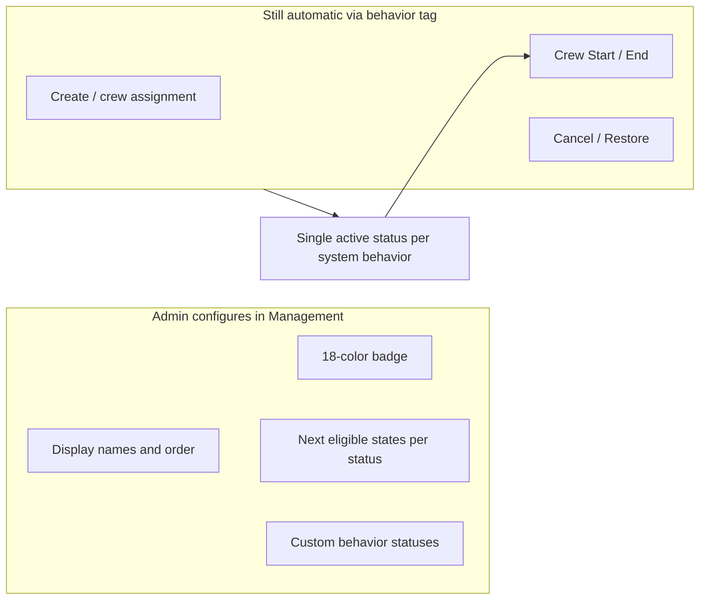

# Task status management settings

## Current system — state diagram (automated transitions only)

Today there are **7 statuses** in the PostgreSQL `task_status` enum. The diagram below shows **system-driven** transitions only (create, crew assignment, crew Start/End, cancel, restore). Manual admin status changes (`PATCH /api/tasks/:id/status`) are documented in the trigger table and manual graph below — not shown here.

```mermaid
stateDiagram-v2
  direction TB

  state "Unassigned" as Unassigned
  state "Assigned" as Assigned
  state "In Progress" as InProgress
  state "Completed" as Completed
  state "Failed" as Failed
  state "Undetermined" as Undetermined
  state "Cancelled" as Cancelled

  Unassigned --> Assigned: createTask crew assigned
  Assigned --> Unassigned: createTask no crew OR updateTask crew removed
  Unassigned --> Assigned: updateTask crew added

  Assigned --> InProgress: crew Start first time
  InProgress --> InProgress: crew Start again same user noop

  Completed --> InProgress: crew Start reopen
  Undetermined --> InProgress: crew Start reopen

  Assigned --> Completed: crew End all ended all success
  InProgress --> Completed: crew End all ended all success
  Assigned --> Failed: crew End all ended all failed
  InProgress --> Failed: crew End all ended all failed
  Assigned --> Undetermined: crew End mixed outcomes
  InProgress --> Undetermined: crew End mixed outcomes

  note right of InProgress
    Crew Start blocked on Failed and Cancelled.
    Reopen allowed from Completed and Undetermined only.
  end note

  state Cancelled {
    [*] --> Cancelled
  }

  Assigned --> Cancelled: DELETE cancelTask
  InProgress --> Cancelled: DELETE cancelTask
  Completed --> Cancelled: DELETE cancelTask
  Failed --> Cancelled: DELETE cancelTask
  Undetermined --> Cancelled: DELETE cancelTask
  Unassigned --> Cancelled: DELETE cancelTask

  Cancelled --> Undetermined: POST restoreTask within retention
```

### Trigger reference table

| Trigger | UI / API | From | To | Notes |
|---------|----------|------|-----|-------|
| Task create | `createTask` | — | `Unassigned` / `Assigned` | Based on crew assignment |
| Crew assignment edit | `updateTask` | `Unassigned` ↔ `Assigned` | Only when current status is one of these two |
| Manual status change | `PATCH /api/tasks/:id/status` | Per [`STATUS_TRANSITIONS`](shared/statusTransitions.js) | Validated in `updateTaskStatus`; `Failed` requires notes; `Completed`/`Failed` can attach per-user notes |
| Crew Start | `POST /api/tasks/:id/crew-events` (`started`) | `Assigned` (etc.) | `In Progress` | Also reopens from `Completed` / `Undetermined` |
| Crew End (all starters ended) | same endpoint (`ended`) | non-terminal | `Completed` / `Failed` / `Undetermined` | Derived from per-crew outcomes |
| Cancel | `DELETE /api/tasks/:id` | any non-`Cancelled` | `Cancelled` | Force-ends open crew starts; sets `cancelled_at` / `archive_at` |
| Restore | `POST /api/tasks/:id/restore` | `Cancelled` | `Undetermined` | Only within org retention window |

**Manual-only graph** (what Management “next eligible states” will configure):

| From | Allowed manual targets |
|------|------------------------|
| Unassigned | Assigned |
| Assigned | In Progress, Failed |
| In Progress | Completed, Failed, Undetermined |
| Completed | In Progress, Failed, Undetermined |
| Failed | Completed, Undetermined |
| Undetermined | Completed, Failed |
| Cancelled | *(none)* |

Cancel and restore **do not** use this table — they stay dedicated endpoints tied to the `cancelled` and `mixed` behaviors.

---

## Target model — behavior tags

You chose **behavior tags** so crew automation follows semantics, not display names.

| Behavior | Purpose | Max active | Default seed name |
|----------|---------|------------|-------------------|
| `unassigned` | New task, no crew | 1 | Unassigned |
| `assigned` | Crew assigned, not started | 1 | Assigned |
| `active` | Crew Start / reopen target | 1 | In Progress |
| `success` | All crew succeeded; reopenable | 1 | Completed |
| `failure` | All crew failed; terminal for crew | 1 | Failed |
| `mixed` | Mixed crew outcomes; restore target | 1 | Undetermined |
| `cancelled` | Cancel endpoint only | 1 | Cancelled |
| `custom` | Manual transitions only | unlimited | *(new statuses)* |

Server helpers in [`server/orgSettings.mjs`](server/orgSettings.mjs): `statusByBehavior(org, behavior)`, `resolveStatusName(org, behavior)`.

Crew logic in [`server/createTask.mjs`](server/createTask.mjs) replaces string literals (`"In Progress"`, `TERMINAL_STATUSES`, etc.) with behavior lookups. Reopenable = behaviors `success` + `mixed` (not `failure`).

---

## Data layer

New migration `db/migrations/055_org_task_statuses.sql`:

- **`org_task_statuses`**: `id`, `name`, `slug`, `badge_color` (0–17), `behavior` (enum/check), `enabled`, `sort_order`, `retired_at` — same append-only pattern as [`org_task_types`](db/migrations/044_non_retroactive_config.sql)
- **`org_task_status_transitions`**: `(from_status_id, to_status_id)` — manual admin graph only
- **`tasks.status_id`** FK + backfill from current enum; change `tasks.status` to `varchar(100)` (mirror task-type migration 039/044); drop `task_status` enum when safe
- Seed 7 defaults with current manual transitions and behavior tags; assign badge colors from existing [`tokens.css`](src/styles/tokens.css) status hues

---

## Shared palette (18 colors)

New [`shared/statusBadgePalette.js`](shared/statusBadgePalette.js):

- 18 fixed tokens with **light-mode** and **dark-mode** background values chosen for contrast with black or white text (WCAG-ish mid/high saturation)
- `badgeTextColor(badgeColor, colorScheme)` → `'black' | 'white'` via relative luminance
- Exported for Management picker and [`TaskStatusBadge`](src/components/TaskStatusBadge.tsx)

Replace per-name CSS in [`src/styles/tasks.css`](src/styles/tasks.css) with `.task-status[data-badge-color="N"]` using CSS variables from the palette.

---

## Common status presets

New [`shared/commonTaskStatuses.js`](shared/commonTaskStatuses.js) — deduped list from your suggestions (Scheduled, Inspecting, Repairing, …). New statuses default to `behavior: custom` and a default palette slot.

New [`src/components/StatusNameCombobox.tsx`](src/components/StatusNameCombobox.tsx) — same pattern as [`TaskTypeNameCombobox`](src/components/TaskTypeNameCombobox.tsx).

---

## API / org settings bundle

Extend existing org settings path (no new CRUD routes):

| Layer | Changes |
|-------|---------|
| [`server/orgSettings.mjs`](server/orgSettings.mjs) | `syncTaskStatuses`, `normalizeAndValidateTaskStatuses`, load transitions; enforce unique active system behaviors |
| [`src/api/orgSettings.ts`](src/api/orgSettings.ts) | `OrgTaskStatus { id?, name, slug, badgeColor, behavior, enabled, sortOrder, nextStatusIds }` |
| [`shared/orgSettingsDraft.js`](shared/orgSettingsDraft.js) | Include `taskStatuses` in dirty snapshot |
| [`src/context/OrgSettingsContext.tsx`](src/context/OrgSettingsContext.tsx) | Default `taskStatuses: []` |

Replace [`shared/statusTransitions.js`](shared/statusTransitions.js) with `statusTransitionsFromOrg(taskStatuses)` building `Record<name, name[]>` from transition rows (delete hardcoded `STATUS_TRANSITIONS` per greenfield rule).

---

## Management UI

Add **Task statuses** section to [`src/pages/ManagementPage.tsx`](src/pages/ManagementPage.tsx) (after Task types), using existing [`SettingsGrid`](src/components/SettingsGrid.tsx):

| Column | Control |
|--------|---------|
| Enabled | Checkbox |
| Name | `StatusNameCombobox` |
| Badge color | New `StatusBadgeColorPicker` — 18 swatch grid, live preview via `TaskStatusBadge` |
| Behavior | Select (`unassigned` … `custom`); disable/hide for seeded system rows if we lock behavior on defaults |
| Next states | `MultiSelect` of other configured status names (exclude self) |
| Reorder / remove | Same as task types |

Validation hints inline (from prototype [`StatusTransitionsPrototypePage.tsx`](src/pages/StatusTransitionsPrototypePage.tsx)): unreachable statuses, `custom` with no transitions, duplicate behavior tags.

Help text: “Manual transitions apply to the status menu. Crew Start/End, Cancel, and Restore use behavior tags.”

Remove dev prototype route/link after this ships ([`src/App.tsx`](src/App.tsx), Management dev link ~L459).

---

## App wiring (replace hardcoded status)

| Area | Change |
|------|--------|
| [`src/types/task.ts`](src/types/task.ts) | `TaskStatus` → `string` |
| [`TaskStatusBadge`](src/components/TaskStatusBadge.tsx) | Accept `badgeColor` from org lookup by name/slug |
| [`TaskDetailModal`](src/components/TaskDetailModal.tsx) | Menu from org transitions |
| [`TasksPage`](src/pages/TasksPage.tsx) | Filter tabs map to behaviors (`active`, `success`, …) not fixed names |
| [`TaskViewPage`](src/pages/TaskViewPage.tsx), [`TaskStartedCrew`](src/components/TaskStartedCrew.tsx) | `behavior === 'active'` instead of `=== 'In Progress'` |
| [`server/createTask.mjs`](server/createTask.mjs) | All status writes via org resolution |
| [`server/index.mjs`](server/index.mjs) | `cancelTask` / `restoreTask` use behavior lookup |
| Tests | Update [`tests/statusTransitions.test.ts`](tests/statusTransitions.test.ts), [`tests/taskStatusFlow.test.ts`](tests/taskStatusFlow.test.ts) to use org fixture |

---

## Interface complexity (for your review)

What admins configure vs what stays automatic:



**Simple for admins:** rename “In Progress” → “On Site”, add custom steps like `Inspecting` between `Assigned` and `Completed` via manual transitions.

**Requires care:** assigning behaviors — UI will show which system slot each status fills and block saving two active `active` statuses.

---

## Implementation order

1. Migration + seed + `statusBadgePalette` + `commonTaskStatuses`
2. `orgSettings.mjs` sync/load/validate + API types
3. Management section + picker components
4. Replace `statusTransitions.js` and crew/cancel/restore resolution
5. Badge/display/filter consumers + tests
6. Delete prototype page and hardcoded status CSS

Recommended Effort: **High**

Confidence: **High**

Reason: The task-types pattern is well-established in-repo; scope is large because every status touchpoint (crew automation, cancel/restore, filters, badges, tests) must switch from hardcoded names to org config, but the behavior-tag model keeps automation rules explicit.
